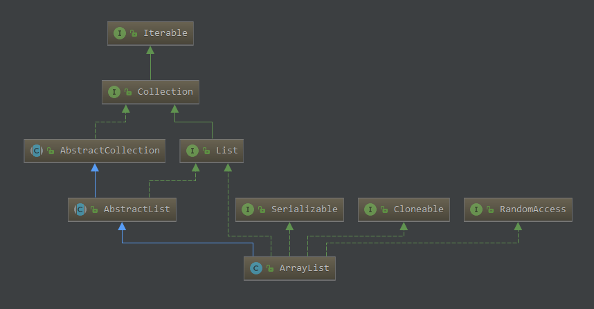

# ArrayList



底层存储是一个Object类型的数组。

```java
// 缓冲区
transient Object[] elementData;
// 数组元素个数
private int size;
// 修改计数
protected transient int modCount = 0;

```

## 新增元素

在确保容量足够的情况下直接设值，并且递增`modCount`。

重点看下怎么扩容的：计算一个新的容量，然后进行数组拷贝。

```java
public boolean add(E e) {
        ensureCapacityInternal(size + 1);  // Increments modCount!!
        elementData[size++] = e;
        return true;
    }

```

```java
private void ensureCapacityInternal(int minCapacity) {
        ensureExplicitCapacity(calculateCapacity(elementData, minCapacity));
    }

private static int calculateCapacity(Object[] elementData, int minCapacity) {
        if (elementData == DEFAULTCAPACITY_EMPTY_ELEMENTDATA) {
            return Math.max(DEFAULT_CAPACITY, minCapacity);
        }
        return minCapacity;
    }

private void ensureExplicitCapacity(int minCapacity) {
        modCount++;

        // overflow-conscious code
        if (minCapacity - elementData.length > 0)
            grow(minCapacity);
    }

private void grow(int minCapacity) {
        // overflow-conscious code
        int oldCapacity = elementData.length;
        int newCapacity = oldCapacity + (oldCapacity >> 1);
        if (newCapacity - minCapacity < 0)
            newCapacity = minCapacity;
        // Integer.MAX_VALUE - 8
        if (newCapacity - MAX_ARRAY_SIZE > 0)
            newCapacity = hugeCapacity(minCapacity);
        // minCapacity is usually close to size, so this is a win:
        elementData = Arrays.copyOf(elementData, newCapacity);
    }
```

## 转换为数组

有两种API，使用的时候要特别注意，踩过坑。

无参的`toArray`方法，拷贝得到的是一个`Object`数组，类型信息丧失了，测试代码看这里[ArrayListDemo](ArrayListDemo.java)。


```java
public Object[] toArray() {
        return Arrays.copyOf(elementData, size);
    }
```

推荐使用带参的`toArray`方法，我们事先分配特定类型数组空间。

```java
public <T> T[] toArray(T[] a) {
        if (a.length < size)
            // Make a new array of a's runtime type, but my contents:
            return (T[]) Arrays.copyOf(elementData, size, a.getClass());
        System.arraycopy(elementData, 0, a, 0, size);
        if (a.length > size)
            a[size] = null;
        return a;
    }
```