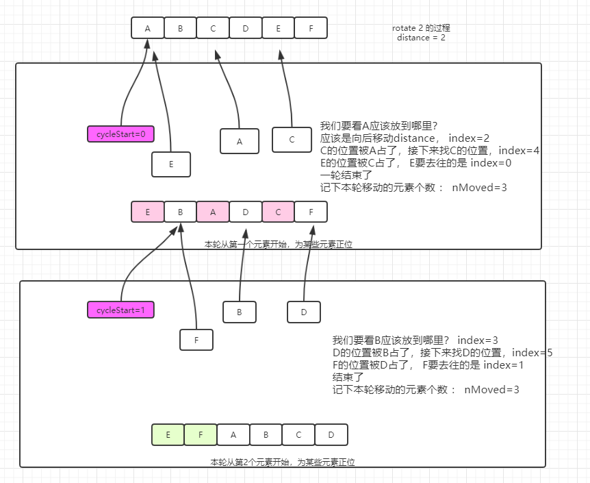

[主页](http://vonzhou.com)  | [读书](https://github.com/vonzhou/readings)  | [知乎](https://www.zhihu.com/people/vonzhou) | [GitHub](https://github.com/vonzhou)
---
# Collections工具类源码阅读
---

## 二分查找 binarySearch :+1:

列表必须是递增排序的,针对是否是可随机访问的列表,根据索引定位元素的方法不同.

有两点可以学习:
* 移位实现除以2
* 如果没有找到,返回的是 -(应该插入的位置)

```java
public static <T>
    int binarySearch(List<? extends Comparable<? super T>> list, T key) {
        // 可随机访问,或者尺寸小于5000
        if (list instanceof RandomAccess || list.size()<BINARYSEARCH_THRESHOLD)
            return Collections.indexedBinarySearch(list, key);
        else
            return Collections.iteratorBinarySearch(list, key);
    }

    private static <T>
    int indexedBinarySearch(List<? extends Comparable<? super T>> list, T key) {
        int low = 0;
        int high = list.size()-1;

        while (low <= high) {
            int mid = (low + high) >>> 1; // 这里
            Comparable<? super T> midVal = list.get(mid);
            int cmp = midVal.compareTo(key);

            if (cmp < 0)
                low = mid + 1;
            else if (cmp > 0)
                high = mid - 1;
            else
                return mid; // key found
        }
        return -(low + 1);  // key not found
    }

    private static <T>
    int iteratorBinarySearch(List<? extends Comparable<? super T>> list, T key)
    {
        int low = 0;
        int high = list.size()-1;
        ListIterator<? extends Comparable<? super T>> i = list.listIterator();

        while (low <= high) {
            int mid = (low + high) >>> 1;
            Comparable<? super T> midVal = get(i, mid);
            int cmp = midVal.compareTo(key);

            if (cmp < 0)
                low = mid + 1;
            else if (cmp > 0)
                high = mid - 1;
            else
                return mid; // key found
        }
        return -(low + 1);  // key not found
    }
```

## 排序 sort :+1:

TimSort

## 逆转 reverse


* 如果是基于数组的,或者长度小于18,则直接前后交换
* 否则,链表操作

```java
public static void reverse(List<?> list) {
        int size = list.size();
        if (size < REVERSE_THRESHOLD || list instanceof RandomAccess) {
            for (int i=0, mid=size>>1, j=size-1; i<mid; i++, j--)
                swap(list, i, j);
        } else {
            // instead of using a raw type here, it's possible to capture
            // the wildcard but it will require a call to a supplementary
            // private method
            ListIterator fwd = list.listIterator();
            ListIterator rev = list.listIterator(size);
            for (int i=0, mid=list.size()>>1; i<mid; i++) {
                Object tmp = fwd.next();
                fwd.set(rev.previous());
                rev.set(tmp);
            }
        }
    }
```

```java
public static void swap(List<?> list, int i, int j) {
        // instead of using a raw type here, it's possible to capture
        // the wildcard but it will require a call to a supplementary
        // private method
        final List l = list;
        l.set(i, l.set(j, l.get(i)));
    }
```


针对ArrayList,LinkedList设值的实现分别是:

```java
public E set(int index, E element) {
        rangeCheck(index);

        E oldValue = elementData(index);
        elementData[index] = element;
        return oldValue;
    }
```

```java
public E set(int index, E element) {
        checkElementIndex(index);
        // 定位
        Node<E> x = node(index);
        E oldVal = x.item;
        x.item = element;
        return oldVal;
    }

   // 从距离近的一端开始找起
  Node<E> node(int index) {
         // assert isElementIndex(index);

         if (index < (size >> 1)) {
             Node<E> x = first;
             for (int i = 0; i < index; i++)
                 x = x.next;
             return x;
         } else {
             Node<E> x = last;
             for (int i = size - 1; i > index; i--)
                 x = x.prev;
             return x;
         }
     }
```

## shuffle

基本的思路就是：将当前元素随机和前面的一个元素交换，从而得到一个随机化的列表，针对链表的话，先转换为数组，shuffle后再转为链表。

```java
 private static final int SHUFFLE_THRESHOLD        =    5;


public static void shuffle(List<?> list) {
        Random rnd = r;
        if (rnd == null)
            r = rnd = new Random(); // harmless race.
        shuffle(list, rnd);
    }


public static void shuffle(List<?> list, Random rnd) {
        int size = list.size();
        if (size < SHUFFLE_THRESHOLD || list instanceof RandomAccess) {
            for (int i=size; i>1; i--)
                swap(list, i-1, rnd.nextInt(i));
        } else {
            Object arr[] = list.toArray();

            // Shuffle array
            for (int i=size; i>1; i--)
                swap(arr, i-1, rnd.nextInt(i));

            // Dump array back into list
            // instead of using a raw type here, it's possible to capture
            // the wildcard but it will require a call to a supplementary
            // private method
            ListIterator it = list.listIterator();
            for (int i=0; i<arr.length; i++) {
                it.next();
                it.set(arr[i]);
            }
        }
    }
```

## 填充 fill

比较简单。

BTW，这里面的常量值都是怎么得到的，经过测试了吗？

```java
private static final int FILL_THRESHOLD           =   25;

public static <T> void fill(List<? super T> list, T obj) {
        int size = list.size();

        if (size < FILL_THRESHOLD || list instanceof RandomAccess) {
            for (int i=0; i<size; i++)
                list.set(i, obj);
        } else {
            ListIterator<? super T> itr = list.listIterator();
            for (int i=0; i<size; i++) {
                itr.next();
                itr.set(obj);
            }
        }
    }
```

## 拷贝 copy

```java
public static <T> void copy(List<? super T> dest, List<? extends T> src) {
        int srcSize = src.size();
        if (srcSize > dest.size())
            throw new IndexOutOfBoundsException("Source does not fit in dest");

        if (srcSize < COPY_THRESHOLD ||
            (src instanceof RandomAccess && dest instanceof RandomAccess)) {
            for (int i=0; i<srcSize; i++)
                dest.set(i, src.get(i));
        } else {
            ListIterator<? super T> di=dest.listIterator();
            ListIterator<? extends T> si=src.listIterator();
            for (int i=0; i<srcSize; i++) {
                di.next();
                di.set(si.next());
            }
        }
    }
```

## 最小值 min,最大值 max

通过过迭代器找最小值，唯一区别的是不同容器实现迭代的方式不同，也是性能影响的地方。

```java
public static <T extends Object & Comparable<? super T>> T min(Collection<? extends T> coll) {
        Iterator<? extends T> i = coll.iterator();
        T candidate = i.next();

        while (i.hasNext()) {
            T next = i.next();
            if (next.compareTo(candidate) < 0)
                candidate = next;
        }
        return candidate;
    }
```

## 旋转 rotate :+1:

`[1, 2, 3, 4, 5, 6]` 旋转1得到`[6, 1, 2, 3, 4, 5]`， 旋转-1得到`[2, 3, 4, 5, 6, 1]`，正负可以理解为向右旋转，向左旋转。

实现数组旋转我想到的是搞个临时数组tmp把前一个部分先保存，然后后一部分迁移，再追加上tmp。看看JDK怎么搞的。


1. 如果是数组或者链表长度小于100，则采用多趟修正元素位置的方式，初看可能不好理解，可以跟几步流程就清晰了



2. 对于长链表，采用的方式是逆序两次

`R(A:::B) = R(R(A):::R(B))`


```java
private static final int ROTATE_THRESHOLD         =  100;

public static void rotate(List<?> list, int distance) {
        if (list instanceof RandomAccess || list.size() < ROTATE_THRESHOLD)
            rotate1(list, distance);
        else
            rotate2(list, distance);
    }

    private static <T> void rotate1(List<T> list, int distance) {
        int size = list.size();
        if (size == 0)
            return;
        distance = distance % size;
        if (distance < 0)
            distance += size;
        if (distance == 0)
            return;

        for (int cycleStart = 0, nMoved = 0; nMoved != size; cycleStart++) {
            T displaced = list.get(cycleStart);
            int i = cycleStart;
            do {
                i += distance;
                if (i >= size)
                    i -= size;
                displaced = list.set(i, displaced);
                nMoved ++;
            } while (i != cycleStart);
        }
    }

    private static void rotate2(List<?> list, int distance) {
        int size = list.size();
        if (size == 0)
            return;
        int mid =  -distance % size;
        if (mid < 0)
            mid += size;
        if (mid == 0)
            return;

        reverse(list.subList(0, mid));
        reverse(list.subList(mid, size));
        reverse(list);
    }
```

## 替换元素 replaceAll

须注意的就是旧值是否为空的情况。

```java
public static <T> boolean replaceAll(List<T> list, T oldVal, T newVal) {
        boolean result = false;
        int size = list.size();
        if (size < REPLACEALL_THRESHOLD || list instanceof RandomAccess) {
            if (oldVal==null) {
                for (int i=0; i<size; i++) {
                    if (list.get(i)==null) {
                        list.set(i, newVal);
                        result = true;
                    }
                }
            } else {
                for (int i=0; i<size; i++) {
                    if (oldVal.equals(list.get(i))) {
                        list.set(i, newVal);
                        result = true;
                    }
                }
            }
        } else {
            ListIterator<T> itr=list.listIterator();
            if (oldVal==null) {
                for (int i=0; i<size; i++) {
                    if (itr.next()==null) {
                        itr.set(newVal);
                        result = true;
                    }
                }
            } else {
                for (int i=0; i<size; i++) {
                    if (oldVal.equals(itr.next())) {
                        itr.set(newVal);
                        result = true;
                    }
                }
            }
        }
        return result;
    }
```

## 定位子列表 indexOfSubList

没啥说的。

```java
public static int indexOfSubList(List<?> source, List<?> target) {
        int sourceSize = source.size();
        int targetSize = target.size();
        int maxCandidate = sourceSize - targetSize;

        if (sourceSize < INDEXOFSUBLIST_THRESHOLD ||
            (source instanceof RandomAccess&&target instanceof RandomAccess)) {
        nextCand:
            for (int candidate = 0; candidate <= maxCandidate; candidate++) {
                for (int i=0, j=candidate; i<targetSize; i++, j++)
                    if (!eq(target.get(i), source.get(j)))
                        continue nextCand;  // Element mismatch, try next cand
                return candidate;  // All elements of candidate matched target
            }
        } else {  // Iterator version of above algorithm
            ListIterator<?> si = source.listIterator();
        nextCand:
            for (int candidate = 0; candidate <= maxCandidate; candidate++) {
                ListIterator<?> ti = target.listIterator();
                for (int i=0; i<targetSize; i++) {
                    if (!eq(ti.next(), si.next())) {
                        // Back up source iterator to next candidate
                        for (int j=0; j<i; j++)
                            si.previous();
                        continue nextCand;
                    }
                }
                return candidate;
            }
        }
        return -1;  // No candidate matched the target
    }
```

## 包装为不可变列表


提供了一个``的视图，操作会使用互斥锁进行同步，

```java
public static <T> List<T> synchronizedList(List<T> list) {
        return (list instanceof RandomAccess ?
                new SynchronizedRandomAccessList<>(list) :
                new SynchronizedList<>(list));
    }

 static class SynchronizedList<E>
         extends SynchronizedCollection<E>
         implements List<E> {
         private static final long serialVersionUID = -7754090372962971524L;

         final List<E> list;

         SynchronizedList(List<E> list) {
             super(list);
             this.list = list;
         }
         SynchronizedList(List<E> list, Object mutex) {
             super(list, mutex);
             this.list = list;
         }

         public boolean equals(Object o) {
             if (this == o)
                 return true;
             synchronized (mutex) {return list.equals(o);}
         }
         public int hashCode() {
             synchronized (mutex) {return list.hashCode();}
         }

         public E get(int index) {
             synchronized (mutex) {return list.get(index);}
         }
         public E set(int index, E element) {
             synchronized (mutex) {return list.set(index, element);}
         }
         public void add(int index, E element) {
             synchronized (mutex) {list.add(index, element);}
         }
         public E remove(int index) {
             synchronized (mutex) {return list.remove(index);}
         }

         public int indexOf(Object o) {
             synchronized (mutex) {return list.indexOf(o);}
         }
         public int lastIndexOf(Object o) {
             synchronized (mutex) {return list.lastIndexOf(o);}
         }

         public boolean addAll(int index, Collection<? extends E> c) {
             synchronized (mutex) {return list.addAll(index, c);}
         }

        // 外面使用的时候也要注意线程安全
         public ListIterator<E> listIterator() {
             return list.listIterator(); // Must be manually synched by user
         }

         public ListIterator<E> listIterator(int index) {
             return list.listIterator(index); // Must be manually synched by user
         }

         public List<E> subList(int fromIndex, int toIndex) {
             synchronized (mutex) {
                 return new SynchronizedList<>(list.subList(fromIndex, toIndex),
                                             mutex);
             }
         }

         @Override
         public void replaceAll(UnaryOperator<E> operator) {
             synchronized (mutex) {list.replaceAll(operator);}
         }
         @Override
         public void sort(Comparator<? super E> c) {
             synchronized (mutex) {list.sort(c);}
         }

         /**
          * SynchronizedRandomAccessList instances are serialized as
          * SynchronizedList instances to allow them to be deserialized
          * in pre-1.4 JREs (which do not have SynchronizedRandomAccessList).
          * This method inverts the transformation.  As a beneficial
          * side-effect, it also grafts the RandomAccess marker onto
          * SynchronizedList instances that were serialized in pre-1.4 JREs.
          *
          * Note: Unfortunately, SynchronizedRandomAccessList instances
          * serialized in 1.4.1 and deserialized in 1.4 will become
          * SynchronizedList instances, as this method was missing in 1.4.
          */
         private Object readResolve() {
             return (list instanceof RandomAccess
                     ? new SynchronizedRandomAccessList<>(list)
                     : this);
         }
     }

```

## disjoint 不相交集

判断2个集合是否不相交。避免不免的是迭代一个集合，然后判断元素是否存在于另一个集合中，为了性能最优，就要决定哪个集合用于迭代，哪个集合判断包含关系。

```java
public static boolean disjoint(Collection<?> c1, Collection<?> c2) {
        // The collection to be used for contains(). Preference is given to
        // the collection who's contains() has lower O() complexity.
        Collection<?> contains = c2;
        // The collection to be iterated. If the collections' contains() impl
        // are of different O() complexity, the collection with slower
        // contains() will be used for iteration. For collections who's
        // contains() are of the same complexity then best performance is
        // achieved by iterating the smaller collection.
        Collection<?> iterate = c1;

        // Performance optimization cases. The heuristics:
        //   1. Generally iterate over c1.
        //   2. If c1 is a Set then iterate over c2.
        //   3. If either collection is empty then result is always true.
        //   4. Iterate over the smaller Collection.
        if (c1 instanceof Set) {
            // Use c1 for contains as a Set's contains() is expected to perform
            // better than O(N/2)
            iterate = c2;
            contains = c1;
        } else if (!(c2 instanceof Set)) {
            // Both are mere Collections. Iterate over smaller collection.
            // Example: If c1 contains 3 elements and c2 contains 50 elements and
            // assuming contains() requires ceiling(N/2) comparisons then
            // checking for all c1 elements in c2 would require 75 comparisons
            // (3 * ceiling(50/2)) vs. checking all c2 elements in c1 requiring
            // 100 comparisons (50 * ceiling(3/2)).
            int c1size = c1.size();
            int c2size = c2.size();
            if (c1size == 0 || c2size == 0) {
                // At least one collection is empty. Nothing will match.
                return true;
            }

            if (c1size > c2size) {
                iterate = c2;
                contains = c1;
            }
        }

        for (Object e : iterate) {
            if (contains.contains(e)) {
               // 有共同元素
                return false;
            }
        }

        // 不相交
        return true;
    }
```