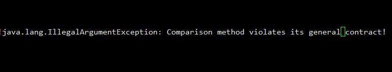
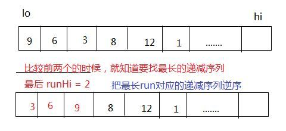
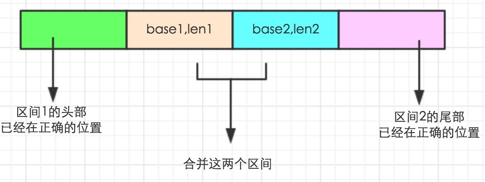

# Collections.sort源码分析


## 序
在平时的开发中总是会用到排序，每次直接写一个Comparator，然后调用Collections.sort()，但是忽略了具体实现的细节。

今天在使用的时候，报了下面的一个错误，原因是比较两个元素时没有明确返回1，-1，0，导致违背了比较的传递性。



## 开始

Collections中sort调用List中的sort方法:

```java
public static <T> void sort(List<T> list, Comparator<? super T> c) {
	list.sort(c);
}

// --> List
default void sort(Comparator<? super E> c) {
	Object[] a = this.toArray();
	Arrays.sort(a, (Comparator) c);
	ListIterator<E> i = this.listIterator();
	for (Object e : a) {
		i.next();
		i.set((E) e);
	}
}
```


Arrays中具体处理，传统的归并，或者timsort:

```java
public static <T> void sort(T[] a, Comparator<? super T> c) {
	if (c == null) {
		sort(a);
	} else { // 因为TimSort是jdk1.7引入的，使用了性能更好的Timsort，但是也是可以使用遗留的merge sort
		if (LegacyMergeSort.userRequested)
			legacyMergeSort(a, c);
		else
			TimSort.sort(a, 0, a.length, c, null, 0, 0);
	}
}
```

## TimSort实现

排序这个数组的给定区间，后面三个参数先忽略。待排序的个数如果小于32（MIN_MERGE），比较简单。

```java
static <T> void sort(T[] a, int lo, int hi, Comparator<? super T> c,
	T[] work, int workBase, int workLen) {
	assert c != null && a != null && lo >= 0 && lo <= hi && hi <= a.length;

	int nRemaining  = hi - lo;
	if (nRemaining < 2)
		 return;  // Arrays of size 0 and 1 are always sorted

    // If array is small, do a "mini-TimSort" with no merges      情况（1）
    if (nRemaining < MIN_MERGE) {  // 32
    	int initRunLen = countRunAndMakeAscending(a, lo, hi, c);
    	binarySort(a, lo, hi, lo + initRunLen, c);
    	return;
    }

    /**
     * March over the array once, left to right, finding natural runs,
     * extending short natural runs to minRun elements, and merging runs
     * to maintain stack invariant.							情况（2）
     */
    TimSort<T> ts = new TimSort<>(a, c, work, workBase, workLen);
    int minRun = minRunLength(nRemaining);
    do {
        // Identify next run
    	int runLen = countRunAndMakeAscending(a, lo, hi, c);

        // If run is short, extend to min(minRun, nRemaining)
    	if (runLen < minRun) { // 尽可能的做一次
    		int force = nRemaining <= minRun ? nRemaining : minRun;
    		binarySort(a, lo, lo + force, lo + runLen, c);
            // 对[lo,lo+force]拍好序了，当然下次的 run length 长度是force
    		runLen = force;
    	}

        // Push run onto pending-run stack, and maybe merge
        // 把这次run的基点位置和长度存入栈中，必要时合并
    	ts.pushRun(lo, runLen);
    	ts.mergeCollapse(); // TimSort持有数组a，根据区间来合并，从而达到排序

        // Advance to find next run  准备下一轮的部分排序
    	lo += runLen;
    	nRemaining -= runLen;
    } while (nRemaining != 0);

    // Merge all remaining runs to complete sort
    assert lo == hi;
    ts.mergeForceCollapse();
    assert ts.stackSize == 1;
}
```

先看看run的定义，翻译成趋向？一个run是从数组给定位置开始的最长递增活递减序列的长度，为了得到稳定的归并排序，这里的降序中使用的“>”，不包含"=",保证stability。代码中的原注释是：

```
* Returns the length of the run beginning at the specified position in
* the specified array and reverses the run if it is descending (ensuring
* that the run will always be ascending when the method returns).
*
* A run is the longest ascending sequence with:
*
*    a[lo] <= a[lo + 1] <= a[lo + 2] <= ...
*
* or the longest descending sequence with:
*
*    a[lo] >  a[lo + 1] >  a[lo + 2] >  ...
*
* For its intended use in a stable mergesort, the strictness of the
* definition of "descending" is needed so that the call can safely
* reverse a descending sequence without violating stability.
```

具体计算最长run长度：

```java
private static <T> int countRunAndMakeAscending(T[] a, int lo, int hi,
                                                Comparator<? super T> c) {
    assert lo < hi;
    int runHi = lo + 1;
    if (runHi == hi)
        return 1;

    // Find end of run, and reverse range if descending
    if (c.compare(a[runHi++], a[lo]) < 0) { // Descending
        while (runHi < hi && c.compare(a[runHi], a[runHi - 1]) < 0)
            runHi++;
        // 如果是递减序列，那么就得到最长的，然后逆序
        reverseRange(a, lo, runHi);
    } else {                              // Ascending
        while (runHi < hi && c.compare(a[runHi], a[runHi - 1]) >= 0)
            runHi++;
    }

    return runHi - lo;  // 这个run的最大长度
}
```

举个例子吧，如下图：




## 排序小数组
获得初始的run长度后，调用 binarySort(a, lo, hi, lo + initRunLen, c)，binarySort 当然不会浪费时间再去排序在求run长度时已经排好序的头部（lo->start），然后进行二分插入排序。

binarySort要做的就是把后续的元素依次插入到属于他们的位置，基点就是已经排好序的子数组（如果没有的子数组就是首元素），把当前操作的元素称为pivot，通过二分查找，找到自己应该插入的位置（达到的状态是left==right），找到位置后，就要为pivot的插入腾出空间，所以需要元素的移动，代码中如果移动少于两个元素就直接操作，否则调用System.arraycopy()，最后插入我们的pivot到正确的位置。

这样我想到了之前在学习排序的时候的几个算法，其中有个说法是，对于小数组的排序使用插入排序，大数组的时候使用快排，归并排序之类的。

```java
/**
* Sorts the specified portion of the specified array using a binary
* insertion sort.  This is the best method for sorting small numbers
* of elements.  It requires O(n log n) compares, but O(n^2) data
* movement (worst case).
*
*/
private static <T> void binarySort(T[] a, int lo, int hi, int start,
	Comparator<? super T> c) {
	assert lo <= start && start <= hi;
	if (start == lo)
		start++;
	for ( ; start < hi; start++) {
		T pivot = a[start];

        // Set left (and right) to the index where a[start] (pivot) belongs
		int left = lo;
		int right = start;
		assert left <= right;
        /*
         * Invariants:  排序过程的不变量
         *   pivot >= all in [lo, left).
         *   pivot <  all in [right, start).
         */
        while (left < right) {
        	int mid = (left + right) >>> 1;
        	 // 二分查找找到属于pivot的位置
        	if (c.compare(pivot, a[mid]) < 0)
        		right = mid;
        	else
        		left = mid + 1;
        }
        assert left == right;

        /*
         * The invariants still hold: pivot >= all in [lo, left) and
         * pivot < all in [left, start), so pivot belongs at left.  Note
         * that if there are elements equal to pivot, left points to the
         * first slot after them -- that's why this sort is stable.
         * Slide elements over to make room for pivot.
         */
        int n = start - left;  // The number of elements to move
        // Switch is just an optimization for arraycopy in default case
        switch (n) { // 移动元素
        	case 2:  a[left + 2] = a[left + 1];
        	case 1:  a[left + 1] = a[left];
        	break;
        	default: System.arraycopy(a, left, a, left + 1, n);
        }
        // 属于自己的位置
        a[left] = pivot;
    }
}
```

## 排序大数组
接下来看如果待排序的个数>=32时的过程，首先弄明白minRunLength得到的是什么。注释很清楚，虽然理论基础不理解。

```
* Roughly speaking, the computation is:
*
*  If n < MIN_MERGE, return n (it's too small to bother with fancy stuff).
*  Else if n is an exact power of 2, return MIN_MERGE/2.
*  Else return an int k, MIN_MERGE/2 <= k <= MIN_MERGE, such that n/k
*   is close to, but strictly less than, an exact power of 2.
```

如果还是很抽象的话，从32到100得到的min run length如下，可以直观的体会下：

16,17,17,18,18,19,19,20,20,21,21,22,22,23,23,24,24,25,25,26,26,27,27,28,28,29,29,30,30,31,31,32,16,17,17,17,17,18,18,18,18,19,19,19,19,20,20,20,20,21,21,21,21,22,22,22,22,23,23,23,23,24,24,24,24,25,25,25

得到 minRun 之后，取 minRun 和 nRemaining 的最小值作为这次要排序的序列，初始的有序数组和前面情况（1）的获取方式一样，然后做一次二分插入排序，现在有序序列的长度是force，这一部分排好序之后，把本次run的起始位置和长度存入一个stack中（两个数组），后续就是根据这些区间完成排序的。每次push之后就是要进行合并检查，也就是说相邻的区间能合并的就合并，具体的：

```java
/**
 * Examines the stack of runs waiting to be merged and merges adjacent runs
 * until the stack invariants are reestablished:
 *
 *     1. runLen[i - 3] > runLen[i - 2] + runLen[i - 1]
 *     2. runLen[i - 2] > runLen[i - 1]
 *
 * This method is called each time a new run is pushed onto the stack,
 * so the invariants are guaranteed to hold for i < stackSize upon
 * entry to the method.
 */
private void mergeCollapse() {
    while (stackSize > 1) {
        int n = stackSize - 2;
        if (n > 0 && runLen[n-1] <= runLen[n] + runLen[n+1]) {
            if (runLen[n - 1] < runLen[n + 1])
                n--;
            mergeAt(n);
        } else if (runLen[n] <= runLen[n + 1]) {
            mergeAt(n);
        } else {
            break; // Invariant is established
        }
    }
}
```

我的理解下，虽然每次run之后都能进行合并，但是为了减少合并带来的开销，找到了某种规则，可以在某些条件下避免合并。接下来看看具体合并时的动作。

## 合并有序区间
有一种情况是：如果前一个区间的长度小于当前区间长度，就进行merge，每个区间是一个排好序的数组，现在要合并第i和i+1个区间。

首先把 run length更新到 ruLen[i] 中，删掉 i+1 的run信息；接下来定位区间2的最小元素在有序区间1的插入位置，更新区间1的 run base 和 run length,称更新后的为区间1'; 然后查找区间1'的最大元素在区间2的正确定位；此时此刻这个数组已经得到了有效的划分，如下图，只需要合并[base1,len1]和[base2,len2]就可以了，其他段已经在正确位置。





```java
private void mergeAt(int i) {
    assert stackSize >= 2;
    assert i >= 0;
    assert i == stackSize - 2 || i == stackSize - 3;

    int base1 = runBase[i];
    int len1 = runLen[i];
    int base2 = runBase[i + 1];
    int len2 = runLen[i + 1];
    assert len1 > 0 && len2 > 0;
    assert base1 + len1 == base2;

    /*
     * （1） 合并了 i,i+1, 把i+2的信息移动到之前i+1的位置，就是删除i+1
     * Record the length of the combined runs; if i is the 3rd-last
     * run now, also slide over the last run (which isn't involved
     * in this merge).  The current run (i+1) goes away in any case.
     */
    runLen[i] = len1 + len2;
    if (i == stackSize - 3) {
        runBase[i + 1] = runBase[i + 2];
        runLen[i + 1] = runLen[i + 2];
    }
    stackSize--;

    /*
     *（2）找到区间2的最小元素若插入到区间的话，正确索引位置
     * Find where the first element of run2 goes in run1. Prior elements
     * in run1 can be ignored (because they're already in place).
     */
    int k = gallopRight(a[base2], a, base1, len1, 0, c);
    assert k >= 0;
    base1 += k;
    len1 -= k;
    // 说明区间2的最小元素在区间1的末尾，所以完成两个区间的合并排序
    if (len1 == 0)
        return;

    /*
     * （3）查找区间1'的最大元素在区间2的正确定位
     * Find where the last element of run1 goes in run2. Subsequent elements
     * in run2 can be ignored (because they're already in place).
     */
    len2 = gallopLeft(a[base1 + len1 - 1], a, base2, len2, len2 - 1, c);
    assert len2 >= 0;
    // 说明区间1'的最大元素小于区间2的最小元素，所以完成排序
    if (len2 == 0)
        return;

    // Merge remaining runs, using tmp array with min(len1, len2) elements
    if (len1 <= len2)
        mergeLo(base1, len1, base2, len2);
    else
        mergeHi(base1, len1, base2, len2);
}
```

为了性能，在len1<=len2的时候使用mergeLo，len1>=len2的时候使用mergeHi，通过前面的定位，到这里的时候，有a[base1]>a[base2],a[base1+len1]<a[base2+len2]，合并后，最终完成了排序。

参考

[Timsort — the fastest sorting algorithm you’ve never heard of](https://hackernoon.com/timsort-the-fastest-sorting-algorithm-youve-never-heard-of-36b28417f399)

http://bugs.java.com/bugdatabase/view_bug.do?bug_id=6804124