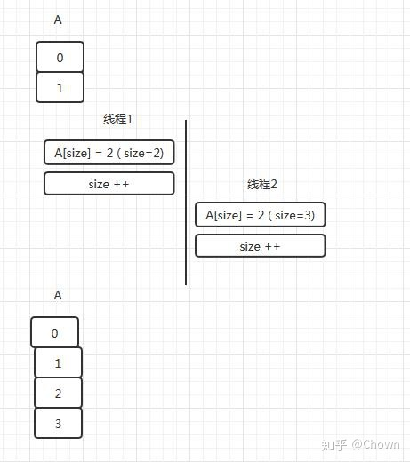
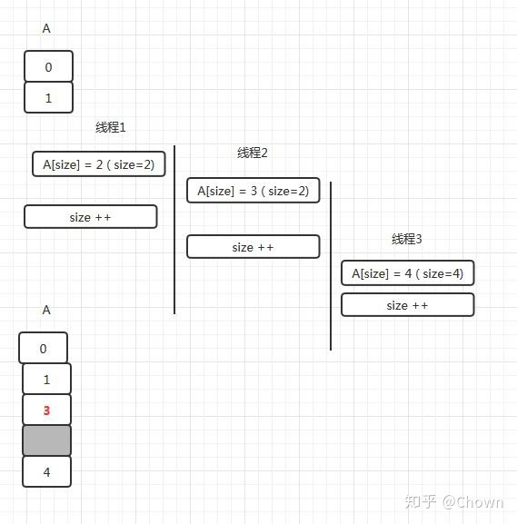

[主页](http://vonzhou.com)  | [读书](https://github.com/vonzhou/readings)  | [知乎](https://www.zhihu.com/people/vonzhou) | [GitHub](https://github.com/vonzhou)
---
# 记一次 ArrayList 线程安全问题
---

记录一次因为考虑ArrayList线程安全欠周导致的NPE问题。

在开发过程中遇到一个场景，要把记录数据根据时间分组到不同的区间（比如，周，月，季度），实现的思路是采用二分查找得到记录归属的分组，寻思采用并行流 效率会好点。

## 场景


```java
private List<List<Record>> arrangeByInsertTime(List<Record> list, long[] dayTs) {
    int size = dayTs.length;
    List<List<Record>> buckets = new ArrayList<>(size);

    for (int i = 0; i < size; i++) {
        buckets.add(Lists.newArrayList());
    }

    if (CollectionUtils.isEmpty(list)) {
        return buckets;
    }

    list.parallelStream().forEach(r -> {
        int pos = Arrays.binarySearch(dayTs, r.getInsertTime());
        if (pos >= 0) {
            buckets.get(pos).add(r);
        } else {
            pos = Math.abs(pos) - 2;
            if (pos >= 0 && pos < dayTs.length) {
                buckets.get(pos).add(r);
            }
        }
    });

    return buckets;
}

```


然而不料后续出现了空指针异常（NPE），不应该啊，然后想到可能是链表的线程安全问题，打算重现一下。


```java
@Test
public void listNotSafe() throws Exception {
    List<Integer> list = Lists.newArrayList();
    for (int i = 0; i < 4; i++) {
        new Thread(new Runnable() {
            @Override
            public void run() {
                for (int j = 0; j < 10000; j++) {
                    list.add(new Random().nextInt(100));
                }
            }
        }).start();
    }

    Thread.sleep(1000 * 60 * 1);

    log.info("size = " + list.size());
    for (int i = 0; i < list.size(); i++) {
        if (list.get(i) == null) {
            log.info(String.format("[%s] : HOLE", i));
        }
    }

}

```

结果就很容易重现了这个问题，多线程下面往列表中增加元素导致了一些空洞现象。

```
2018-06-15 15:54:17.578  INFO 7644 --- [           main] .d.s.ConversionCountStatisticServiceTest : size = 37610
2018-06-15 15:54:17.578  INFO 7644 --- [           main] .d.s.ConversionCountStatisticServiceTest : [1851] : HOLE
2018-06-15 15:54:17.578  INFO 7644 --- [           main] .d.s.ConversionCountStatisticServiceTest : [4164] : HOLE
2018-06-15 15:54:17.579  INFO 7644 --- [           main] .d.s.ConversionCountStatisticServiceTest : [4165] : HOLE
2018-06-15 15:54:17.579  INFO 7644 --- [           main] .d.s.ConversionCountStatisticServiceTest : [6246] : HOLE
2018-06-15 15:54:17.579  INFO 7644 --- [           main] .d.s.ConversionCountStatisticServiceTest : [9369] : HOLE
2018-06-15 15:54:17.580  INFO 7644 --- [           main] .d.s.ConversionCountStatisticServiceTest : [14053] : HOLE
2018-06-15 15:54:17.580  INFO 7644 --- [           main] .d.s.ConversionCountStatisticServiceTest : [14054] : HOLE
2018-06-15 15:54:17.581  INFO 7644 --- [           main] .d.s.ConversionCountStatisticServiceTest : [21079] : HOLE
2018-06-15 15:54:17.581  INFO 7644 --- [           main] .d.s.ConversionCountStatisticServiceTest : [21080] : HOLE
2018-06-15 15:54:17.581  INFO 7644 --- [           main] .d.s.ConversionCountStatisticServiceTest : [21081] : HOLE
2018-06-15 15:54:17.582  INFO 7644 --- [           main] .d.s.ConversionCountStatisticServiceTest : [31618] : HOLE
```


问题的答案就在 ArrayList 增加元素的代码中。

```java
/**
 * Appends the specified element to the end of this list.
 *
 * @param e element to be appended to this list
 * @return <tt>true</tt> (as specified by {@link Collection#add})
 */
public boolean add(E e) {
    ensureCapacityInternal(size + 1);  // Increments modCount!!
    elementData[size++] = e;
    return true;
}
```


本质是 `i++` 操作在 Java 中是非线程安全的，这个大家都知道，通过字节码可以看到。

下面通过示意图展示多线程环境下 add 出现问题的情形。图2中线程T1，T2同时去增加元素，当前 index=2，然后都去设置这个位置的值，然后T1，T2分别更新了索引位置，导致了 index=3的位置出现了空洞。





## 总结

* 在Stream处理过程中处理引用类型的值要格外注意。
* ArrayList 在多线程环境下使用，大家都知道会出现 modCount 不一致异常，但是多线程 Add 虽不会出现异常，但是会出现逻辑问题，影响正确性。


