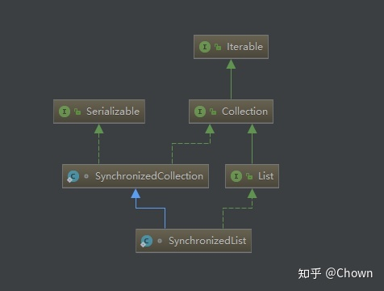

[主页](http://vonzhou.com)  | [读书](https://github.com/vonzhou/readings)  | [知乎](https://www.zhihu.com/people/vonzhou) | [GitHub](https://github.com/vonzhou)
---
# 如何保证ArrayList在多线程环境下的线程安全性
---

如果想在多线程环境下使用ArrayList，如果保障其线程安全性？

## 序

在[记一次 ArrayList 线程安全问题](http://vonzhou.com/arraylist-thread-safe-case.html)一文中说明了`ArrayList`用在多线程环境中存在问题。关键的原因就是`ArrayList`底层实现新增元素时数组索引的移动操作。

```java
/**
 * Appends the specified element to the end of this list.
 *
 * @param e element to be appended to this list
 * @return <tt>true</tt> (as specified by {@link Collection#add})
 */
public boolean add(E e) {
    ensureCapacityInternal(size + 1);  // Increments modCount!!
    elementData[size++] = e;
    return true;
}
```


非线程安全场景展示：


```java
public static void notThreadSafe() throws Exception {
    final List<Integer> list = Lists.newArrayList();
    for (int i = 0; i < 4; i++) {
        new Thread(new Runnable() {
            @Override
            public void run() {
                for (int j = 0; j < 10000; j++) {
                    list.add(new Random().nextInt(100));
                }
            }
        }).start();

    }

    Thread.sleep(1000 * 30);

    System.out.println("size = " + list.size());
    for (int i = 0; i < list.size(); i++) {
        if (list.get(i) == null) {
            System.out.println("ERROR===================");
        }
    }
    System.out.println("OVER========================");
}
```

执行输出：

```
Exception in thread "Thread-2" java.lang.ArrayIndexOutOfBoundsException: 22
	at java.util.ArrayList.add(ArrayList.java:463)
	at com.vonzhou.learn.javase.collection.ArrayListThreadSafeDemo$1.run(ArrayListThreadSafeDemo.java:23)
	at java.lang.Thread.run(Thread.java:748)
size = 28857
ERROR===================
ERROR===================
ERROR===================
ERROR===================
ERROR===================
ERROR===================
ERROR===================
ERROR===================
ERROR===================
ERROR===================
ERROR===================
ERROR===================
ERROR===================
ERROR===================
OVER========================
```


Java中 `i++` 并非线程安全的，这样多个线程同时往一个ArrayList中加元素，导致元素丢失，出现空洞。那么如果想在多线程环境中使用ArrayList，有哪些保证其线程安全性的方法呢？

## 同步

既然ArrayList不是线程安全的，第一种很容易想到的方法就是使用synchronized来同步所有的ArrayList操作方法，JDK工具类为我们提供了。Collections.synchronizedList()方法其实底层也是在集合的所有方法之上加上了synchronized（默认使用的是同一个monitor对象，也可以自己指定）。

```
public static <T> List<T> synchronizedList(List<T> list) {
    return (list instanceof RandomAccess ?
            new SynchronizedRandomAccessList<>(list) :
            new SynchronizedList<>(list));
}
```



代码展示：

```java
public static void useSynchronized() throws Exception {
    final List<Integer> list = Collections.synchronizedList(Lists.newArrayList());
    for (int i = 0; i < 4; i++) {
        new Thread(new Runnable() {
            @Override
            public void run() {
                for (int j = 0; j < 10000; j++) {
                    list.add(new Random().nextInt(100));
                }
            }
        }).start();

    }

    Thread.sleep(1000 * 30);

    System.out.println("size = " + list.size());
    for (int i = 0; i < list.size(); i++) {
        if (list.get(i) == null) {
            System.out.println("ERROR===================");
        }
    }
    System.out.println("OVER========================");
}
```

执行输出：

```
size = 40000
OVER========================
```

此外，文档中有提到：当我们要迭代 Collections.synchronizedList() 返回的列表时，必须手动同步。


```java
public static void iterWithLock() {
    List<String> list = Collections.synchronizedList(new ArrayList<String>());
    list.add("apple");
    list.add("mi");
    list.add("huawei");

    synchronized (list) {
        Iterator it = list.iterator();
        while (it.hasNext())
            System.out.println(it.next());
    }
}
```

## COW 写时拷贝

Copy On Write 也是一种重要的思想，在写少读多的场景下，为了保证集合的线程安全性，我们完全可以在当前线程中得到原始数据的一份拷贝，然后进行操作。JDK集合框架中为我们提供了 ArrayList 的这样一个实现：`CopyOnWriteArrayList`。但是如果==不是写少读多的场景，使用 `CopyOnWriteArrayList` 开销比较大，因为每次对其更新操作（add/set/remove）都会做一次数组拷贝。==


代码展示：

```java
public static void useCOW() throws Exception {
    CopyOnWriteArrayList<String> list = new CopyOnWriteArrayList<>();
    for (int i = 0; i < 4; i++) {
        new Thread(new Runnable() {
            @Override
            public void run() {
                for (int j = 0; j < 10; j++) {
                    list.add(String.format("T%s-%s",Thread.currentThread().getId(), j));
                }
            }
        }).start();

    }

    Thread.sleep(1000 * 10);
    System.out.println("size = " + list.size());
    for (int i = 0; i < list.size(); i++) {
        System.out.println(list.get(i));
        if (list.get(i) == null) {
            System.out.println("ERROR===================");
        }
    }
    System.out.println("OVER========================");
}
```

执行输出：

```
size = 40
T11-0
T14-0
T13-0
T11-1
T14-1
T13-1
T11-2
T14-2
T13-2
T11-3
T14-3
T13-3
T11-4
T14-4
T13-4
T11-5
T14-5
T13-5
T11-6
T14-6
T13-6
T11-7
T14-7
T13-7
T11-8
T14-8
T13-8
T11-9
T14-9
T13-9
T12-0
T12-1
T12-2
T12-3
T12-4
T12-5
T12-6
T12-7
T12-8
T12-9
OVER========================
```


## 总结

在多线程环境下可以使用 `Collections.synchronizedList()` 或者 `CopyOnWriteArrayList` 来实现 `ArrayList` 的线程安全性。虽然 Vector（已废弃） 每个方法也都有同步关键字，但是一般不使用，一方面是慢，另一方面是不能保证多个方法的组合是线程安全的（因为不是基于同一个monitor）。


