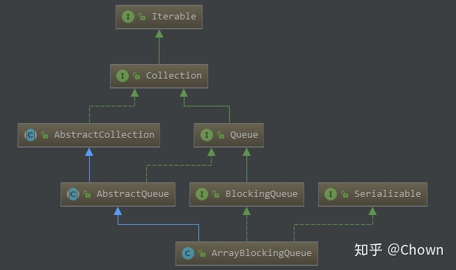
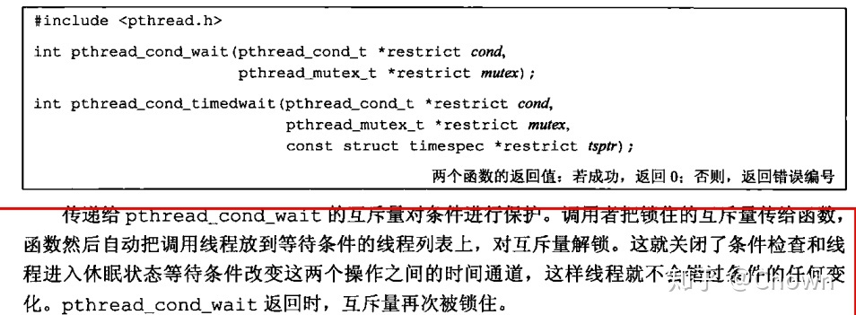
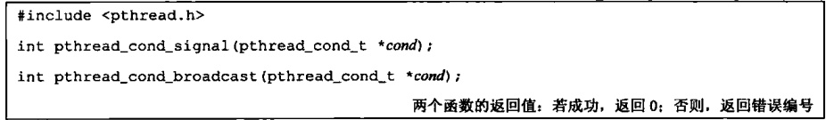

# 深入理解条件变量Condition

## 序

可重入锁（`ReentrantLock`）是 `synchronized` 关键字的扩展，更加灵活。还有一种`ReentrantLock`应用场景是和`Condition`搭配使用，实现多线程环境下等待状态条件的功能。`Object.wait` 和 `Object.notify` 是和 `synchronized` 配合使用的，条件变量`Condition`是和`ReentrantLock`相关联的。

接下来先通过一个Demo看看`Condition`的用法，然后列举两个应用的地方，最后分析其源码实现。

## 一个简单Demo

先通过一个Demo看看怎么使用`Condition`，主线程通知条件满足，通过另一个线程继续运行，可以看到的是`Condition.wait/signal`方法需要和一个`ReentrantLock`绑定。

```java
public class ReenterLockCondition implements Runnable {
    public static ReentrantLock lock = new ReentrantLock();
    public static Condition condition = lock.newCondition();

    @Override
    public void run() {
        try {
            lock.lock();
            condition.await();
            System.out.println(String.format("条件满足，线程%s运行！", Thread.currentThread().getName()));
        } catch (InterruptedException e) {
            e.printStackTrace();
        } finally {
            lock.unlock();
        }

    }

    public static void main(String args[]) throws InterruptedException {
        ReenterLockCondition reenterLockCondition = new ReenterLockCondition();
        Thread thread1 = new Thread(reenterLockCondition);
        thread1.setName("T1");
        thread1.start();
        Thread.sleep(2000);
        System.out.println("通知T1条件满足");
        lock.lock();
        condition.signal();
        lock.unlock();
    }
}
```

## 应用举例：JDK ArrayBlockingQueue




JDK并发包中的 `ArrayBlockingQueue` 就使用了`Condition`来同步队列的空/满状态。先看条件变量的定义：

```java
/** Main lock guarding all access */
final ReentrantLock lock;

/** Condition for waiting takes */
private final Condition notEmpty;

/** Condition for waiting puts */
private final Condition notFull;

public ArrayBlockingQueue(int capacity, boolean fair) {
    if (capacity <= 0)
        throw new IllegalArgumentException();
    this.items = new Object[capacity];
    lock = new ReentrantLock(fair);
    notEmpty = lock.newCondition();
    notFull =  lock.newCondition();
}
```

`ArrayBlockingQueue` 构造的时候初始化了2个条件变量：非空，非满，他们都是和同一个重入锁关联的。

元素入队的时候，如果队列一直满的话就一直阻塞等待非满条件为真，否则的话就插入对应的元素，并且通知非空条件为真。


```java
public void put(E e) throws InterruptedException {
    checkNotNull(e);
    final ReentrantLock lock = this.lock;
    lock.lockInterruptibly();
    try {
        while (count == items.length)
            notFull.await();
        enqueue(e);
    } finally {
        lock.unlock();
    }
}

private void enqueue(E x) {
    // assert lock.getHoldCount() == 1;
    // assert items[putIndex] == null;
    final Object[] items = this.items;
    items[putIndex] = x;
    if (++putIndex == items.length)
        putIndex = 0;
    count++;
    notEmpty.signal();
}
```

同样的，出队的时候，如果队列没有元素就等待非空的条件为真，否则出队，并通知非满条件为真。

```java
public E take() throws InterruptedException {
    final ReentrantLock lock = this.lock;
    lock.lockInterruptibly();
    try {
        while (count == 0)
            notEmpty.await();
        return dequeue();
    } finally {
        lock.unlock();
    }
}

private E dequeue() {
    // assert lock.getHoldCount() == 1;
    // assert items[takeIndex] != null;
    final Object[] items = this.items;
    @SuppressWarnings("unchecked")
    E x = (E) items[takeIndex];
    items[takeIndex] = null;
    if (++takeIndex == items.length)
        takeIndex = 0;
    count--;
    if (itrs != null)
        itrs.elementDequeued();
    notFull.signal();
    return x;
}
    
    
```

## 应用举例：Kafaka BufferPool

`KafkaProducer`里面有一个buffer pool的概念，`BufferPool`里面内存分配，回收过程也有用到条件变量。

```java
public ByteBuffer allocate(int size, long maxTimeToBlockMs) throws InterruptedException {
    this.lock.lock();
    try {
        // check if we have a free buffer of the right size pooled
        if (size == poolableSize && !this.free.isEmpty())
            return this.free.pollFirst();

        // now check if the request is immediately satisfiable with the
        // memory on hand or if we need to block
        int freeListSize = this.free.size() * this.poolableSize;
        if (this.availableMemory + freeListSize >= size) {
            // 不断释放free队列中的buffer，直到可用内存>size
            // we have enough unallocated or pooled memory to immediately
            // satisfy the request
            freeUp(size);
            this.availableMemory -= size;
            lock.unlock();
            // 使用的不是free队列中的buffer，而是直接分配HeapByteBuffer
            return ByteBuffer.allocate(size);
        } else {
            // 没有足够空间，阻塞
            // we are out of memory and will have to block
            int accumulated = 0;
            ByteBuffer buffer = null;
            Condition moreMemory = this.lock.newCondition();
            long remainingTimeToBlockNs = TimeUnit.MILLISECONDS.toNanos(maxTimeToBlockMs);
            this.waiters.addLast(moreMemory);
            // loop over and over until we have a buffer or have reserved
            // enough memory to allocate one
            while (accumulated < size) {
                long startWaitNs = time.nanoseconds();
                long timeNs;
                boolean waitingTimeElapsed;
                try {
                    waitingTimeElapsed = !moreMemory.await(remainingTimeToBlockNs, TimeUnit.NANOSECONDS);
                } catch (InterruptedException e) {
                    this.waiters.remove(moreMemory);
                    throw e;
                } finally {
                    long endWaitNs = time.nanoseconds();
                    timeNs = Math.max(0L, endWaitNs - startWaitNs);
                    this.waitTime.record(timeNs, time.milliseconds());
                }

                if (waitingTimeElapsed) {
                    this.waiters.remove(moreMemory);
                    throw new TimeoutException("Failed to allocate memory within the configured max blocking time " + maxTimeToBlockMs + " ms.");
                }

                remainingTimeToBlockNs -= timeNs;
                // check if we can satisfy this request from the free list,
                // otherwise allocate memory
                if (accumulated == 0 && size == this.poolableSize && !this.free.isEmpty()) {
                    // just grab a buffer from the free list
                    buffer = this.free.pollFirst();
                    accumulated = size;
                } else {
                    // 先分配一部分空间
                    // we'll need to allocate memory, but we may only get
                    // part of what we need on this iteration
                    freeUp(size - accumulated);
                    int got = (int) Math.min(size - accumulated, this.availableMemory);
                    this.availableMemory -= got;
                    accumulated += got;
                }
            }

            // 成功分配空间后，移除条件变量
            // remove the condition for this thread to let the next thread
            // in line start getting memory
            Condition removed = this.waiters.removeFirst();
            if (removed != moreMemory)
                throw new IllegalStateException("Wrong condition: this shouldn't happen.");

            // 如果还有剩余空间，还有等待线程，则唤醒
            // signal any additional waiters if there is more memory left
            // over for them
            if (this.availableMemory > 0 || !this.free.isEmpty()) {
                if (!this.waiters.isEmpty())
                    this.waiters.peekFirst().signal();
            }

            // unlock and return the buffer
            lock.unlock();
            if (buffer == null)
                return ByteBuffer.allocate(size);
            else
                return buffer;
        }
    } finally {
        if (lock.isHeldByCurrentThread())
            lock.unlock();
    }
}
    
public void deallocate(ByteBuffer buffer, int size) {
    lock.lock();
    try {
        // 如果是poolableSize大小的buffer，则入free队列管理
        if (size == this.poolableSize && size == buffer.capacity()) {
            buffer.clear();
            this.free.add(buffer);
        } else {
            // 否则直接增加大小，分配的buffer由GC回收
            this.availableMemory += size;
        }

        // 唤醒一个因内存分配得不到满足而阻塞的线程
        Condition moreMem = this.waiters.peekFirst();
        if (moreMem != null)
            moreMem.signal();
    } finally {
        lock.unlock();
    }
}    
```


## 实现分析

接下来看看条件变量是怎么实现的？可重入锁关联的条件变量实现类是AQS内部类`ConditionObject`，接下来通过其中的await和signal方法的源码看看`Condition`的实现。


```java
public final void await() throws InterruptedException {
    if (Thread.interrupted())
        throw new InterruptedException();
    Node node = addConditionWaiter();
    
    // 释放关联的锁
    int savedState = fullyRelease(node);
    int interruptMode = 0;
    
    // 如果该节点没有放入同步队列(sync queue)，则阻塞等待
    while (!isOnSyncQueue(node)) {
        LockSupport.park(this);
        if ((interruptMode = checkInterruptWhileWaiting(node)) != 0)
            break;
    }
    
    // 节点进入了同步队列，则争用锁，锁获取成功后，await就退出了
    if (acquireQueued(node, savedState) && interruptMode != THROW_IE)
        interruptMode = REINTERRUPT;
    if (node.nextWaiter != null) // clean up if cancelled
        unlinkCancelledWaiters();
    if (interruptMode != 0)
        reportInterruptAfterWait(interruptMode);
}

// 新增一个条件节点
private Node addConditionWaiter() {
    Node t = lastWaiter;
    // If lastWaiter is cancelled, clean out.
    if (t != null && t.waitStatus != Node.CONDITION) {
        unlinkCancelledWaiters();
        t = lastWaiter;
    }
    Node node = new Node(Thread.currentThread(), Node.CONDITION);
    if (t == null)
        firstWaiter = node;
    else
        t.nextWaiter = node;
    lastWaiter = node;
    return node;
}
```


```java
public final void signal() {
    // 先判断当前线程是否获取了锁，否则异常
    if (!isHeldExclusively())
        throw new IllegalMonitorStateException();
    Node first = firstWaiter;
    if (first != null)
        doSignal(first);
}

// 摘除头节点，把头节点移到同步队列
private void doSignal(Node first) {
    do {
        if ( (firstWaiter = first.nextWaiter) == null)
            lastWaiter = null;
        first.nextWaiter = null;
    } while (!transferForSignal(first) &&
             (first = firstWaiter) != null);
}

final boolean transferForSignal(Node node) {
     // CAS 将状态设置为0,0是一个无效的状态
    if (!compareAndSetWaitStatus(node, Node.CONDITION, 0))
        return false;

    /*
     * Splice onto queue and try to set waitStatus of predecessor to
     * indicate that thread is (probably) waiting. If cancelled or
     * attempt to set waitStatus fails, wake up to resync (in which
     * case the waitStatus can be transiently and harmlessly wrong).
     */
    Node p = enq(node);
    int ws = p.waitStatus;
    
    // 唤醒线程
    if (ws > 0 || !compareAndSetWaitStatus(p, ws, Node.SIGNAL))
        LockSupport.unpark(node.thread);
    return true;
}

// 这个方法是AQS中的，node进入同步队列
private Node enq(final Node node) {
    for (;;) {
        Node t = tail;
        if (t == null) { // Must initialize
            if (compareAndSetHead(new Node()))
                tail = head;
        } else {
            node.prev = t;
            if (compareAndSetTail(t, node)) {
                t.next = node;
                return t;
            }
        }
    }
}
```


## Linux环境下的条件变量

了解Linux环境编程的会想到其中也有条件变量的机制来实现线程之间的同步，和Java中的基本上语义是相同的，在等待条件的时候都会原子的释放锁。






