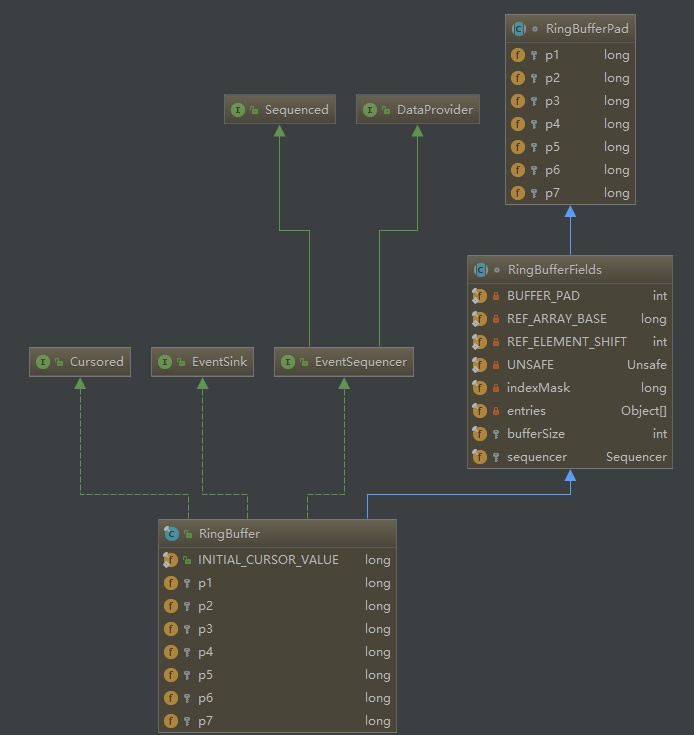

[主页](http://vonzhou.com)  | [读书](https://github.com/vonzhou/readings)  | [知乎](https://www.zhihu.com/people/vonzhou) | [GitHub](https://github.com/vonzhou)
---
# Disruptor 快速入门
---



为了提高系统的吞吐量，通常会采用队列来实现批量处理，发布订阅模式，异步等场景。在JDK的内置队列中，一般实际中会使用`ArrayBlockingQueue`，一方面是有界的，另一方面是通过加锁实现的线程安全，比如在使用线程池的时候最佳实践就是指定了一个 `ArrayBlockingQueue` 作为任务队列。


```java
ExecutorService service = new ThreadPoolExecutor(4, 4, 0L, TimeUnit.MILLISECONDS,
                new ArrayBlockingQueue<Runnable>(CAPACITY), new RejectedExecutionHandler() {

                    @Override
                    public void rejectedExecution(Runnable r, ThreadPoolExecutor executor) {
                       // 实现自己的拒绝策略
                    }
                });
```

LMAX公司开发的 Disruptor 通过无锁（CAS），避免缓存行伪共享，环形数组（RingBuffer）实现了更高的性能，Storm，Log4j2中都使用了 Disruptor。

本文是 Disruptor 快速入门篇。

## 引入依赖


依赖配置。

```java
<dependency>
    <groupId>com.lmax</groupId>
    <artifactId>disruptor</artifactId>
    <version>3.3.7</version>
</dependency>
```

## 定义事件，事件工厂

定义一个简单的事件，这里假设要处理的是日志消息。

```java
@Data
public class LogEvent {
    private String msg;
}


public class LogEventFactory implements EventFactory<LogEvent> {
    @Override
    public LogEvent newInstance() {
        return new LogEvent();
    }
}
```

**事件工厂用于 Disruptor 在 RingBuffer 中预分配空间**，从 RingBuffer 的源码可以看到这一点。


```java
private void fill(EventFactory<E> eventFactory)
{
    for (int i = 0; i < bufferSize; i++)
    {
        entries[BUFFER_PAD + i] = eventFactory.newInstance();
    }
}
```

## 消费者

定义消费者来处理我们的事件。

```java
public class LogEventConsumer implements EventHandler<LogEvent> {

    @Override
    public void onEvent(LogEvent event, long sequence, boolean endOfBatch) throws Exception {
        System.out.println(Thread.currentThread().getName() + " | Event : " + event);
    }
}
```

## 生产者

定义事件的源头，里面的事件转换器（EventTranslatorOneArg）会把输出的参数转为我们的事件类型。

```java
public class LogEventProducer {
    private final RingBuffer<LogEvent> ringBuffer;

    public LogEventProducer(RingBuffer<LogEvent> ringBuffer) {
        this.ringBuffer = ringBuffer;
    }

    private static final EventTranslatorOneArg<LogEvent, String> TRANSLATOR = new EventTranslatorOneArg<LogEvent, String>() {
        public void translateTo(LogEvent event, long sequence, String bb) {
            event.setMsg(bb);
        }
    };


    public void onData(String msg){
        ringBuffer.publishEvent(TRANSLATOR, msg);
    }
}
```

## 组装 Disruptor

把上述组件组装起来就可以了，Disruptor 构造器中的两个参数-生产者类型 ProducerType（单个，或者多个？），WaitStrategy（等待RingBuffer中对应序列号可用的策略）会影响 Disruptor 的性能。

```java
public class LogEventMain {
    public static void main(String[] args) {
        LogEventFactory factory = new LogEventFactory();

        // 环形数组的容量，必须要是2的次幂
        int bufferSize = 1024;

        // 构造 Disruptor
        Disruptor<LogEvent> disruptor = new Disruptor<>(factory, bufferSize, DaemonThreadFactory.INSTANCE, ProducerType.SINGLE,
                        new YieldingWaitStrategy());

        // 设置消费者
        disruptor.handleEventsWith(new LogEventConsumer());

        // 启动 Disruptor
        disruptor.start();

        // 生产者要使用 Disruptor 的环形数组
        RingBuffer<LogEvent> ringBuffer = disruptor.getRingBuffer();

        LogEventProducer producer = new LogEventProducer(ringBuffer);

        // 模拟消息发送
        for (int i = 0; i < 10000; i++) {
            producer.onData(String.format("msg-%s", i));
        }
    }
}
```

