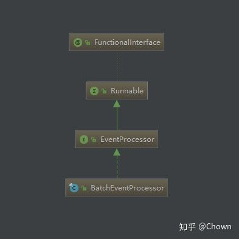
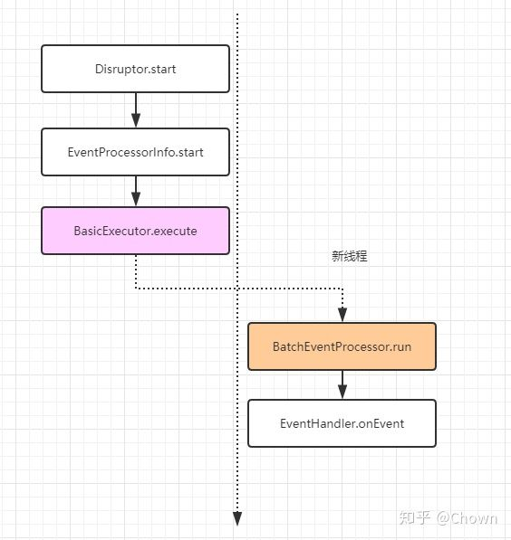
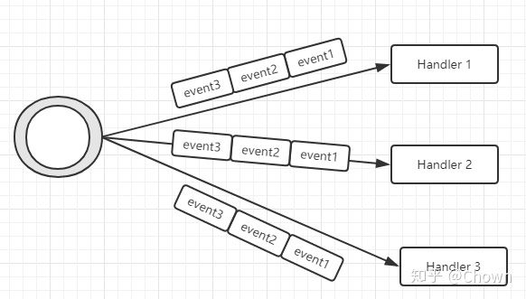
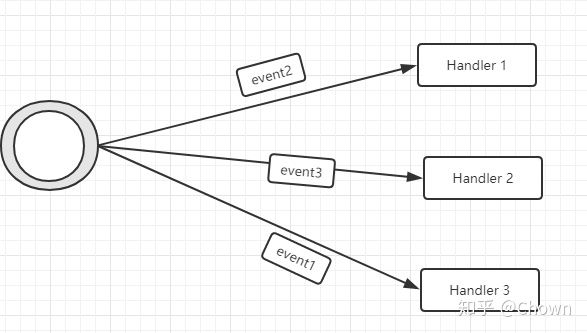
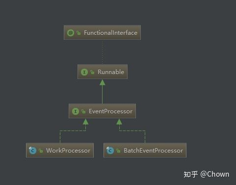
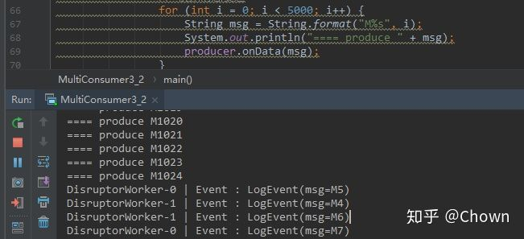
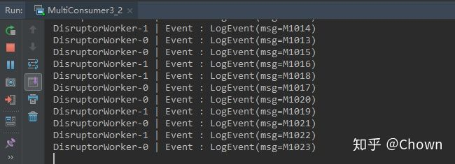

# Disruptor中的事件消费模式
---

Disruptor中有两种事件消费模式，多播（Multicast）:每个消费者都处理相同的消息，WorkPool：多个消费者合作消费一批消息。

在[Disruptor快速入门](DisruptorHello.md)中，我们在构造 Disruptor 的时候，明确指定了单生产者模式，那么消费者呢？有几个消费者线程来处理消息？每个事件会被处理几次？

当我们调用 `disruptor.handleEventsWith` 设置消息的处理器时，我们提供的 Event Handler 会被包装为 `BatchEventProcessor`。

```java
public EventHandlerGroup<T> handleEventsWith(final EventHandler<? super T>... handlers)
{
    return createEventProcessors(new Sequence[0], handlers);
}

EventHandlerGroup<T> createEventProcessors(
    final Sequence[] barrierSequences,
    final EventHandler<? super T>[] eventHandlers)
{
    checkNotStarted();

    final Sequence[] processorSequences = new Sequence[eventHandlers.length];
    final SequenceBarrier barrier = ringBuffer.newBarrier(barrierSequences);

    for (int i = 0, eventHandlersLength = eventHandlers.length; i < eventHandlersLength; i++)
    {
        final EventHandler<? super T> eventHandler = eventHandlers[i];

        // 这里
        final BatchEventProcessor<T> batchEventProcessor =
            new BatchEventProcessor<T>(ringBuffer, barrier, eventHandler);

        if (exceptionHandler != null)
        {
            batchEventProcessor.setExceptionHandler(exceptionHandler);
        }

        consumerRepository.add(batchEventProcessor, eventHandler, barrier);
        processorSequences[i] = batchEventProcessor.getSequence();
    }

    updateGatingSequencesForNextInChain(barrierSequences, processorSequences);

    return new EventHandlerGroup<T>(this, consumerRepository, processorSequences);
}
```

BatchEventProcessor 实现了 Runnable 接口。



在 Disruptor 启动的时候，就会根据上述构造的消费者相关信息（ConsumerRepository）启动对应的线程去轮询消息并处理。



新线程就会一直从 RingBuffer 中轮询消息并调用对应的事件处理器处理。


通过上述的分析，我们可以知道消费者线程的个数取决于我们构造 Disruptor 时提供的 EventHandler 的个数。所以第一种实现多消费者模式的方法就是提供多个 EventHandler。


## 多个消费者各自处理事件（Multicast）

给 Disruptor 提供多个 EventHandler 就会开启多个消费者工作线程，每个消费者都会处理所有的事件，是一种多播模式。

```java
EventHandler<LogEvent>[] consumers = new LogEventConsumer[WORKER_SIZE];
for (int i = 0; i < consumers.length; i++) {
    consumers[i] = new LogEventConsumer();
}
disruptor.handleEventsWith(consumers);
```





接下来看下源码为何如此？消费者想要获取到 RingBuffer 中的元素，就需要从 `Sequnce`中取得可用的序列号，否则就会执行等待策略。前面已经说过， EventHandler 最终封装为 BatchEventProcessor，每个  BatchEventProcessor 在执行 EventHandler 相应逻辑之前都会先获取可用的序列号，因为每个 `BatchEventProcessor` 独立维护了一个 `Sequence`对象，所以每个事件都会被所有的消费者处理一遍。

```java
// 从0开始
private final Sequence sequence = new Sequence(Sequencer.INITIAL_CURSOR_VALUE);

public void run()
{
    if (!running.compareAndSet(false, true))
    {
        throw new IllegalStateException("Thread is already running");
    }
    sequenceBarrier.clearAlert();

    notifyStart();

    T event = null;
    // 获取下一个序列号
    long nextSequence = sequence.get() + 1L;
    try
    {
        while (true)
        {
            try
            {
                // 等待有可取的事件
                final long availableSequence = sequenceBarrier.waitFor(nextSequence);
                if (batchStartAware != null)
                {
                    batchStartAware.onBatchStart(availableSequence - nextSequence + 1);
                }

                while (nextSequence <= availableSequence)
                {
                    event = dataProvider.get(nextSequence);
                    // 处理消息
                    eventHandler.onEvent(event, nextSequence, nextSequence == availableSequence);
                    nextSequence++;
                }

                sequence.set(availableSequence);
            }
            catch (final TimeoutException e)
            {
                notifyTimeout(sequence.get());
            }
            catch (final AlertException ex)
            {
                if (!running.get())
                {
                    break;
                }
            }
            catch (final Throwable ex)
            {
                exceptionHandler.handleEventException(ex, nextSequence, event);
                sequence.set(nextSequence);
                nextSequence++;
            }
        }
    }
    finally
    {
        notifyShutdown();
        running.set(false);
    }
}
```


## 多个消费者合作处理一批事件

上面的方式是每个 Consumer 都会处理相同的消息，**可以联系 EventBus，Kafka里面的 ConsumerGroup**。那么如果想多个 Consumer 协作处理一批消息呢？此时可以利用 Disruptor 的 `WorkPool` 支持，我们定制相应的线程池（Executor）来处理 EventWorker 任务。




使用这种模式的一种场景是处理每个事件比较耗时，开启多个线程来加快处理。

```java
// Fixed Thread Pool
ExecutorService executor = new ThreadPoolExecutor(WORKER_SIZE, WORKER_SIZE, 0L, TimeUnit.MILLISECONDS,
                new ArrayBlockingQueue<Runnable>(10), new ThreadFactory() {
                    private int counter = 0;
                    private String prefix = "DisruptorWorker";

                    @Override
                    public Thread newThread(Runnable r) {
                        return new Thread(r, prefix + "-" + counter++);
                    }
                });
// 环形数组的容量，必须要是2的次幂
int bufferSize = 1024;

// 构造 Disruptor
Disruptor<LogEvent> disruptor = new Disruptor<>(new LogEventFactory(), bufferSize, executor, ProducerType.SINGLE,
                new YieldingWaitStrategy());

// 设置消费者
WorkHandler<LogEvent>[] consumers = new LogEventConsumer[WORKER_SIZE];
for (int i = 0; i < consumers.length; i++) {
    consumers[i] = new LogEventConsumer();
}
disruptor.handleEventsWithWorkerPool(consumers);

// 启动 Disruptor
disruptor.start();
```

或者采用下面的形式，本质一样。

```java
RingBuffer<LogEvent> ringBuffer = RingBuffer.create(ProducerType.SINGLE, new LogEventFactory(), bufferSize,
                                                    new YieldingWaitStrategy());
SequenceBarrier barriers = ringBuffer.newBarrier();

WorkerPool<LogEvent> workerPool = new WorkerPool<LogEvent>(ringBuffer, barriers, null, consumers);
ringBuffer.addGatingSequences(workerPool.getWorkerSequences());
workerPool.start(executor);
```


接下来分析怎么做到一个事件只处理一次的。在使用 `WorkPool` 时，我们提供的事件处理器最终会被封装为 `WorkProcessor`，里面的 run 方法便揭示了原因：所有的消费者都是从同一个 `Sequnce` 中取可用的序列号。




```java
public void run()
{
    if (!running.compareAndSet(false, true))
    {
        throw new IllegalStateException("Thread is already running");
    }
    sequenceBarrier.clearAlert();

    notifyStart();

    boolean processedSequence = true;
    long cachedAvailableSequence = Long.MIN_VALUE;
    long nextSequence = sequence.get();
    T event = null;
    while (true)
    {
        try
        {
            // if previous sequence was processed - fetch the next sequence and set
            // that we have successfully processed the previous sequence
            // typically, this will be true
            // this prevents the sequence getting too far forward if an exception
            // is thrown from the WorkHandler
            if (processedSequence)
            {
                processedSequence = false;
                do
                {
                    // 每个 WorkPool 里面的消费者都是从同一个 Sequnce 中取可用的序列号
                    nextSequence = workSequence.get() + 1L;
                    sequence.set(nextSequence - 1L);
                }
                while (!workSequence.compareAndSet(nextSequence - 1L, nextSequence));
            }

            if (cachedAvailableSequence >= nextSequence)
            {
                // 其他都是常规操作
                event = ringBuffer.get(nextSequence);
                workHandler.onEvent(event);
                processedSequence = true;
            }
            else
            {
                cachedAvailableSequence = sequenceBarrier.waitFor(nextSequence);
            }
        }
        catch (final TimeoutException e)
        {
            notifyTimeout(sequence.get());
        }
        catch (final AlertException ex)
        {
            if (!running.get())
            {
                break;
            }
        }
        catch (final Throwable ex)
        {
            // handle, mark as processed, unless the exception handler threw an exception
            exceptionHandler.handleEventException(ex, nextSequence, event);
            processedSequence = true;
        }
    }

    notifyShutdown();

    running.set(false);
}
```

## 一个要注意的问题

在使用 WorkPool 的时候务必要保证一个 Consumer 要对应一个线程，否则当 RingBuffer 满的时候，Producer 和 Consumer 都会阻塞，一个例子。




正因为存在这个问题，所以下面形式的 Disruptor 构造器已废弃。

```java
@Deprecated
public Disruptor(
    final EventFactory<T> eventFactory,
    final int ringBufferSize,
    final Executor executor,
    final ProducerType producerType,
    final WaitStrategy waitStrategy)
{
    this(RingBuffer.create(producerType, eventFactory, ringBufferSize, waitStrategy), executor);
}
```

推荐使用的是提供 ThreadFactory 形式的构造器，后续会根据事件处理器的个数来新增对应的线程。

```java
public Disruptor(
        final EventFactory<T> eventFactory,
        final int ringBufferSize,
        final ThreadFactory threadFactory,
        final ProducerType producerType,
        final WaitStrategy waitStrategy)
{
    this(
        RingBuffer.create(producerType, eventFactory, ringBufferSize, waitStrategy),
        new BasicExecutor(threadFactory));
}
```


