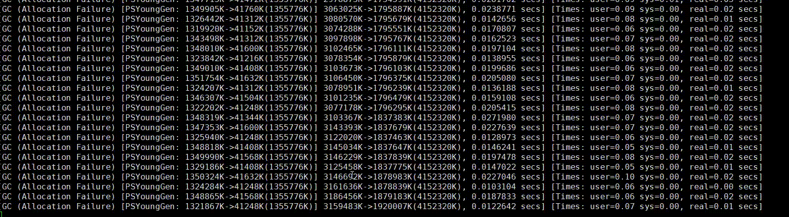
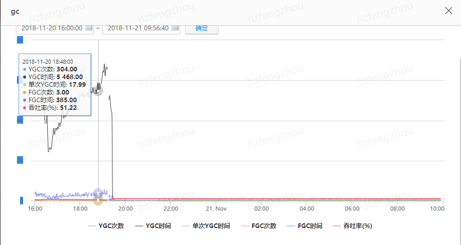
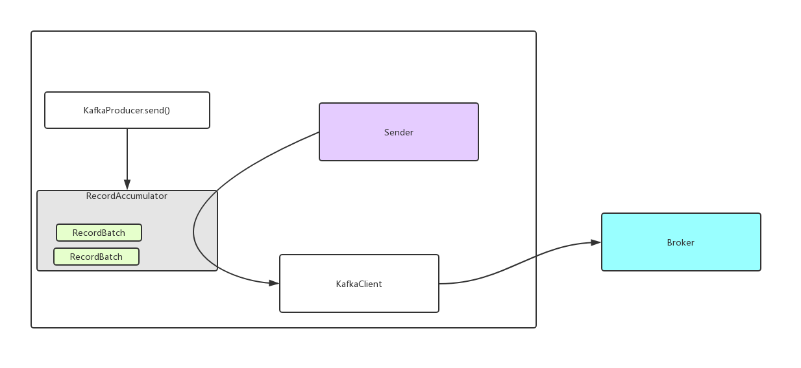

[主页](https://github.com/vonzhou/Blog)  | [读书](https://github.com/vonzhou/readings)  | [知乎](https://www.zhihu.com/people/vonzhou)
---
# 记一次使用KafkaProducer引发的Full GC问题


## 场景

一个模块接收数据，然后投到Kafka中，实现削峰填谷。突然有一天频繁出现Full GC问题。




## 初步尝试

查看JVM的配置，发现最大堆配置的太小，推测：堆内存不足，导致频繁gc，内存不足，导致往kafka发送消息的时候阻塞，所以线程都会卡住。

```
15302 com.xxxx.AppRunner -Dlog.dir=/path/to/logs -Xms1024m -Xmx1024m -XX:MaxPermSize=256m -verbose:gc -XX:+PrintGCDetails
```

调整堆大小配置后，Full GC 问题并没有得到缓解。

## MAT分析

heap dump出现使用MAT分析。


这里的大对象都是我们发送的批量消息对象，推测：是不是`batch.size`设置的过大？（设置的是40MB）

## 解决方法

调小`batch.size`，设置为20MB：

```java
props.put("buffer.memory", 100 * 1024 * 1024);
// 批量发送的字节大小， 20MB
props.put("batch.size", 2 * 10 * 1024 * 1024);
```

最终问题得以解决，连Minor GC也很少了：




## KafkaProducer消息发送过程


KafkaProducer发送消息的过程是：消息追加到一个内部的队列中，有一个异步线程负责从中取出，将消息发送给Broker。




在了解kafka消息发送过程的基础上，通过MAT大对象图还可以看到：

* `buffer.memory`配置的是客户端发送消息时`BufferPool`的内存大小，至少要比`batch.size`大，否则连一个`RecordBatch`也放不进去。
* 实际占用的内存可能是`buffer.memory`的好几倍（4~5倍？），流转多个环节，底层存储都是`ByteBuffer`
