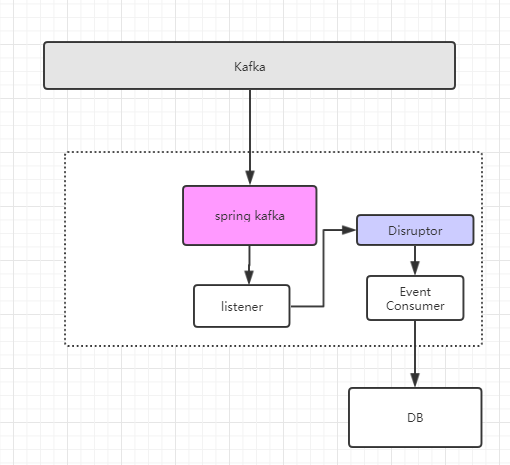
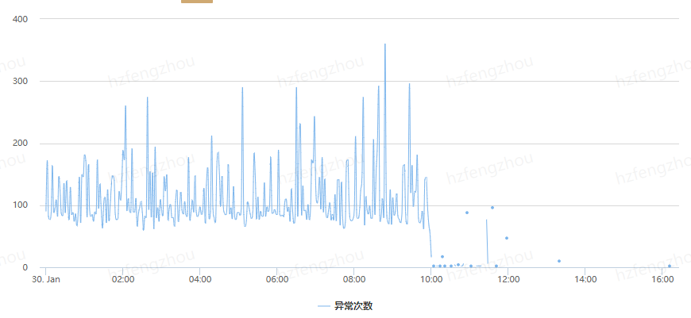

# 大面积offset commit失败，导致不停Rebalance，大量消息重复消费的问题


## 场景





使用spring-kafka，Listener方法中把收到的消息投递到Disruptor队列中，然后Disruptor单Consumer把消息插入到DB中。

采用的手动ACK。


## 严重问题的出现

新版本发布之时，接到大量的报警异常，Consumer不停的进行Rebalance，不停的进行分区重分配，offset提交失败。


```java
2019-01-29 23:59:24 [org.springframework.kafka.KafkaListenerEndpointContainer#0-0-kafka-consumer-1] ERROR o.a.k.c.c.i.ConsumerCoordinator.handle 550 - Error UNKNOWN_MEMBER_ID occurred while committing offsets for group xxxxx_group
2019-01-29 23:59:24 [org.springframework.kafka.KafkaListenerEndpointContainer#0-0-kafka-consumer-1] ERROR o.a.k.c.c.i.ConsumerCoordinator.onJoinPrepare 254 - User provided listener org.springframework.kafka.listener.KafkaMessageListenerContainer$ListenerConsumer$1 failed on partition revocation:
org.apache.kafka.clients.consumer.CommitFailedException: Commit cannot be completed due to group rebalance
	at org.apache.kafka.clients.consumer.internals.ConsumerCoordinator$OffsetCommitResponseHandler.handle(ConsumerCoordinator.java:552)
	at org.apache.kafka.clients.consumer.internals.ConsumerCoordinator$OffsetCommitResponseHandler.handle(ConsumerCoordinator.java:493)
	at org.apache.kafka.clients.consumer.internals.AbstractCoordinator$CoordinatorResponseHandler.onSuccess(AbstractCoordinator.java:665)
	at org.apache.kafka.clients.consumer.internals.AbstractCoordinator$CoordinatorResponseHandler.onSuccess(AbstractCoordinator.java:644)
	at org.apache.kafka.clients.consumer.internals.RequestFuture$1.onSuccess(RequestFuture.java:167)
	at org.apache.kafka.clients.consumer.internals.RequestFuture.fireSuccess(RequestFuture.java:133)
	at org.apache.kafka.clients.consumer.internals.RequestFuture.complete(RequestFuture.java:107)
	at org.apache.kafka.clients.consumer.internals.ConsumerNetworkClient$RequestFutureCompletionHandler.onComplete(ConsumerNetworkClient.java:380)
	at org.apache.kafka.clients.NetworkClient.poll(NetworkClient.java:274)
	at org.apache.kafka.clients.consumer.internals.ConsumerNetworkClient.clientPoll(ConsumerNetworkClient.java:320)
	at org.apache.kafka.clients.consumer.internals.ConsumerNetworkClient.poll(ConsumerNetworkClient.java:213)
	at org.apache.kafka.clients.consumer.internals.ConsumerNetworkClient.poll(ConsumerNetworkClient.java:193)
	at org.apache.kafka.clients.consumer.internals.ConsumerNetworkClient.poll(ConsumerNetworkClient.java:163)
	at org.apache.kafka.clients.consumer.internals.ConsumerCoordinator.commitOffsetsSync(ConsumerCoordinator.java:358)
	at org.apache.kafka.clients.consumer.KafkaConsumer.commitSync(KafkaConsumer.java:968)
	at org.springframework.kafka.listener.KafkaMessageListenerContainer$ListenerConsumer.ackImmediate(KafkaMessageListenerContainer.java:578)
	at org.springframework.kafka.listener.KafkaMessageListenerContainer$ListenerConsumer.manualAck(KafkaMessageListenerContainer.java:559)
	at org.springframework.kafka.listener.KafkaMessageListenerContainer$ListenerConsumer.handleManualAcks(KafkaMessageListenerContainer.java:550)
	at org.springframework.kafka.listener.KafkaMessageListenerContainer$ListenerConsumer.processCommits(KafkaMessageListenerContainer.java:624)
	at org.springframework.kafka.listener.KafkaMessageListenerContainer$ListenerConsumer.stopInvokerAndCommitManualAcks(KafkaMessageListenerContainer.java:504)
	at org.springframework.kafka.listener.KafkaMessageListenerContainer$ListenerConsumer.access$900(KafkaMessageListenerContainer.java:221)
	at org.springframework.kafka.listener.KafkaMessageListenerContainer$ListenerConsumer$1.onPartitionsRevoked(KafkaMessageListenerContainer.java:297)
	at org.apache.kafka.clients.consumer.internals.ConsumerCoordinator.onJoinPrepare(ConsumerCoordinator.java:250)
	at org.apache.kafka.clients.consumer.internals.AbstractCoordinator.ensureActiveGroup(AbstractCoordinator.java:207)
	at org.apache.kafka.clients.consumer.internals.ConsumerCoordinator.ensurePartitionAssignment(ConsumerCoordinator.java:311)
	at org.apache.kafka.clients.consumer.KafkaConsumer.pollOnce(KafkaConsumer.java:890)
	at org.apache.kafka.clients.consumer.KafkaConsumer.poll(KafkaConsumer.java:853)
	at org.springframework.kafka.listener.KafkaMessageListenerContainer$ListenerConsumer.run(KafkaMessageListenerContainer.java:408)
	at java.util.concurrent.Executors$RunnableAdapter.call(Executors.java:511)
	at java.util.concurrent.FutureTask.run(FutureTask.java:266)
	at java.lang.Thread.run(Thread.java:745)
2019-01-29 23:59:24 [org.springframework.kafka.KafkaListenerEndpointContainer#0-0-kafka-consumer-1] INFO  o.a.k.c.c.i.AbstractCoordinator.handle 354 - Attempt to join group xxxxx_group failed due to unknown member id, resetting and retrying.
2019-01-29 23:59:48 [org.springframework.kafka.KafkaListenerEndpointContainer#0-0-kafka-consumer-4] INFO  o.a.k.c.c.i.AbstractCoordinator.handle 623 - Attempt to heart beat failed since the group is rebalancing, try to re-join group.
2019-01-29 23:59:48 [org.springframework.kafka.KafkaListenerEndpointContainer#0-0-kafka-consumer-4] INFO  o.s.k.l.KafkaMessageListenerContainer.onPartitionsRevoked 224 - partitions revoked:[]
2019-01-29 23:59:48 [org.springframework.kafka.KafkaListenerEndpointContainer#1-0-kafka-consumer-2] INFO  o.a.k.c.c.i.AbstractCoordinator.handle 623 - Attempt to heart beat failed since the group is rebalancing, try to re-join group.
2019-01-29 23:59:48 [org.springframework.kafka.KafkaListenerEndpointContainer#1-0-kafka-consumer-2] INFO  o.s.k.l.KafkaMessageListenerContainer.onPartitionsRevoked 224 - partitions revoked:[]
2019-01-29 23:59:48 [org.springframework.kafka.KafkaListenerEndpointContainer#1-0-kafka-consumer-1] INFO  o.a.k.c.c.i.AbstractCoordinator.handle 623 - Attempt to heart beat failed since the group is rebalancing, try to re-join group.
```


offset提交失败，带来的问题就是大量的消息被重复消费，相互影响，不断恶化，导致消息堆积很严重，无法推进。


```java
Caused by: com.mysql.jdbc.exceptions.jdbc4.MySQLIntegrityConstraintViolationException: Duplicate record.
	at sun.reflect.GeneratedConstructorAccessor45.newInstance(Unknown Source)
	at sun.reflect.DelegatingConstructorAccessorImpl.newInstance(DelegatingConstructorAccessorImpl.java:45)
	at java.lang.reflect.Constructor.newInstance(Constructor.java:423)
	at com.mysql.jdbc.Util.handleNewInstance(Util.java:411)
	at com.mysql.jdbc.Util.getInstance(Util.java:386)
	at com.mysql.jdbc.SQLError.createSQLException(SQLError.java:1041)
	at com.mysql.jdbc.MysqlIO.checkErrorPacket(MysqlIO.java:4120)
	at com.mysql.jdbc.MysqlIO.checkErrorPacket(MysqlIO.java:4052)
	at com.mysql.jdbc.MysqlIO.sendCommand(MysqlIO.java:2503)
	at com.mysql.jdbc.MysqlIO.sqlQueryDirect(MysqlIO.java:2664)
	at com.mysql.jdbc.ConnectionImpl.execSQL(ConnectionImpl.java:2815)
	at com.mysql.jdbc.PreparedStatement.executeInternal(PreparedStatement.java:2155)
	at com.mysql.jdbc.PreparedStatement.execute$sentryProxy(PreparedStatement.java:1379)
	at com.mysql.jdbc.PreparedStatement.execute(PreparedStatement.java)
	at com.alibaba.druid.pool.DruidPooledPreparedStatement.execute(DruidPooledPreparedStatement.java:493)
	at org.apache.ibatis.executor.statement.PreparedStatementHandler.update(PreparedStatementHandler.java:46)
	at org.apache.ibatis.executor.statement.RoutingStatementHandler.update(RoutingStatementHandler.java:74)
	at org.apache.ibatis.executor.SimpleExecutor.doUpdate(SimpleExecutor.java:50)
	at org.apache.ibatis.executor.BaseExecutor.update(BaseExecutor.java:117)
	at org.apache.ibatis.executor.CachingExecutor.update(CachingExecutor.java:76)
	at org.apache.ibatis.session.defaults.DefaultSqlSession.update(DefaultSqlSession.java:198)
	at org.apache.ibatis.session.defaults.DefaultSqlSession.insert(DefaultSqlSession.java:185)
	at sun.reflect.GeneratedMethodAccessor84.invoke(Unknown Source)
	at sun.reflect.DelegatingMethodAccessorImpl.invoke(DelegatingMethodAccessorImpl.java:43)
	at java.lang.reflect.Method.invoke(Method.java:498)
	at org.mybatis.spring.SqlSessionTemplate$SqlSessionInterceptor.invoke(SqlSessionTemplate.java:434)
```


## 解决

出现`Error UNKNOWN_MEMBER_ID occurred while committing offsets for group`的原因是在kafka consumer会话超时的时候，没有能把offset提交到broker，所以要么超时时间`session.timeout.ms`设置的太短了，要么消息的处理太慢了影响了ACK的执行，要么虽然是采用了线程池的方式，但是consumer在把消息入队的时候阻塞了，从而影响ACK。

所以总结下来解决的思路是：

* 调参 `session.timeout.ms`
* 加快消息的消费速度，我推荐的方式是单Consumer拿到消息后放到一个队列中，多线程的方式进行消费处理，设置ShutdownHook保证关闭的时候队列中的消息不丢失
* 采用自动commit的方式，但是有数据丢失的风险


在我们的场景中，问题应该出在spring-kafka-listener取消息的速度过快，阻塞在把消息投递到Disruptor中，所以还有一点：

* 降低spring-kafka的并发度


最终的效果：





## 总结

* Kafka的参数常用的要知道，不要盲目设置
* 遇到问题无从下手的时候，看看源码，找到根源


