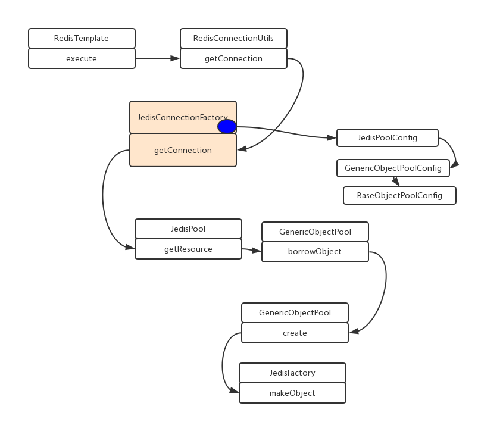

[主页](http://vonzhou.com)  | [读书](https://github.com/vonzhou/readings)  | [知乎](https://www.zhihu.com/people/vonzhou) | [GitHub](https://github.com/vonzhou)
---
# 从连接池(JedisPool)获取Redis连接源码分析
---

本文追踪下SpringBoot中使用StringRedisTemplate，从JedisPool中获取连接的过程，了解了该过程可以更好的进行连接池的参数调优。

一图胜千言，从JedisPool获取一个连接的过程：



接下来走进代码。

在使用StringRedisTemplate或者RedisTemplate操作Redis的时候，其实都最终调用RedisTemplate.execute方法，以最简单的get开始。

```java
// org.springframework.data.redis.core.DefaultValueOperations
public V get(final Object key) {

    return execute(new ValueDeserializingRedisCallback(key) {

        protected byte[] inRedis(byte[] rawKey, RedisConnection connection) {
            return connection.get(rawKey);
        }
    }, true);
}
```

执行之时，先根据我们提供的RedisConnectionFactory（实际的实现是JedisConnectionFactory，要么使用SpringBoot帮我们自动配置的实例，要么自己配置）来获取一个连接，然后就在这个RedisConnection上请求Redis Server。

```java
// org.springframework.data.redis.core.RedisTemplate
public <T> T execute(RedisCallback<T> action, boolean exposeConnection, boolean pipeline) {
    RedisConnectionFactory factory = getConnectionFactory();
    RedisConnection conn = null;
    try {

        if (enableTransactionSupport) {
            // only bind resources in case of potential transaction synchronization
            conn = RedisConnectionUtils.bindConnection(factory, enableTransactionSupport);
        } else {
            // 1. 获取连接
            conn = RedisConnectionUtils.getConnection(factory);
        }

        boolean existingConnection = TransactionSynchronizationManager.hasResource(factory);

        RedisConnection connToUse = preProcessConnection(conn, existingConnection);

        boolean pipelineStatus = connToUse.isPipelined();
        if (pipeline && !pipelineStatus) {
            connToUse.openPipeline();
        }

        RedisConnection connToExpose = (exposeConnection ? connToUse : createRedisConnectionProxy(connToUse));
        // 2. 执行实际的操作
        T result = action.doInRedis(connToExpose);

        // close pipeline
        if (pipeline && !pipelineStatus) {
            connToUse.closePipeline();
        }

        // TODO: any other connection processing?
        return postProcessResult(result, connToUse, existingConnection);
    } finally {
        RedisConnectionUtils.releaseConnection(conn, factory);
    }
}
```

重点看连接获取的过程。

```java
// org.springframework.data.redis.core.RedisConnectionUtils
public static RedisConnection doGetConnection(RedisConnectionFactory factory, boolean allowCreate, boolean bind,
        boolean enableTransactionSupport) {
    // 交给我们的工厂
    RedisConnection conn = factory.getConnection();

    if (bind) {
        RedisConnection connectionToBind = conn;
        if (enableTransactionSupport && isActualNonReadonlyTransactionActive()) {
            connectionToBind = createConnectionProxy(conn, factory);
        }

        connHolder = new RedisConnectionHolder(connectionToBind);

        TransactionSynchronizationManager.bindResource(factory, connHolder);
        if (enableTransactionSupport) {
            potentiallyRegisterTransactionSynchronisation(connHolder, factory);
        }

        return connHolder.getConnection();
    }

    return conn;
}
```

Jedis连接工厂负责创建jedis实例，如果使用连接池，则从池中获取，否则直接创建新的。

```java
// org.springframework.data.redis.connection.jedis.JedisConnectionFactory
public RedisConnection getConnection() {

    if (cluster != null) {
        return getClusterConnection();
    }

    Jedis jedis = fetchJedisConnector();
    JedisConnection connection = (usePool ? new JedisConnection(jedis, pool, dbIndex, clientName)
            : new JedisConnection(jedis, null, dbIndex, clientName));
    connection.setConvertPipelineAndTxResults(convertPipelineAndTxResults);
    return postProcessConnection(connection);
}

protected Jedis fetchJedisConnector() {
    try {
        // 使用连接池的情形
        if (usePool && pool != null) {
            return pool.getResource();
        }

        Jedis jedis = new Jedis(getShardInfo());
        // force initialization (see Jedis issue #82)
        jedis.connect();

        potentiallySetClientName(jedis);
        return jedis;
    } catch (Exception ex) {
        throw new RedisConnectionFailureException("Cannot get Jedis connection", ex);
    }
}
```

接下来是Commons Pool里面的通用逻辑，先看池中的空闲对象（idle object）能否利用，不能的话就只能创建新的对象。此过程中，如果设置了等待超时时间，则超时资源得不到满足就抛出异常“Timeout waiting for idle object”，如果没有设置最大等待时间（maxWaitMillis），就会无限等待，这样如果获取连接的请求很多时就会耗尽系统的线程，要特别注意，实际生产中踩过。


```java
// org.apache.commons.pool2.impl.GenericObjectPool
public T borrowObject(long borrowMaxWaitMillis) throws Exception {
    assertOpen();

    AbandonedConfig ac = this.abandonedConfig;
    if (ac != null && ac.getRemoveAbandonedOnBorrow() &&
            (getNumIdle() < 2) &&
            (getNumActive() > getMaxTotal() - 3) ) {
        removeAbandoned(ac);
    }

    PooledObject<T> p = null;

    // Get local copy of current config so it is consistent for entire
    // method execution
    boolean blockWhenExhausted = getBlockWhenExhausted();

    boolean create;
    long waitTime = System.currentTimeMillis();

    while (p == null) {
        create = false;
        if (blockWhenExhausted) {
            // 1. 复用
            p = idleObjects.pollFirst();
            if (p == null) {
                // 2. 创建新资源对象
                p = create();
                if (p != null) {
                    create = true;
                }
            }
            if (p == null) {
                if (borrowMaxWaitMillis < 0) {
                    // 默认的borrowMaxWaitMillis是-1，会一直阻塞直到满足
                    p = idleObjects.takeFirst();
                } else {
                    p = idleObjects.pollFirst(borrowMaxWaitMillis,
                            TimeUnit.MILLISECONDS);
                }
            }
            if (p == null) {
                throw new NoSuchElementException(
                        "Timeout waiting for idle object");
            }
            if (!p.allocate()) {
                p = null;
            }
        } else {
            p = idleObjects.pollFirst();
            if (p == null) {
                p = create();
                if (p != null) {
                    create = true;
                }
            }
            if (p == null) {
                throw new NoSuchElementException("Pool exhausted");
            }
            if (!p.allocate()) {
                p = null;
            }
        }

        if (p != null) {
            try {
                factory.activateObject(p);
            } catch (Exception e) {
                try {
                    destroy(p);
                } catch (Exception e1) {
                    // Ignore - activation failure is more important
                }
                p = null;
                if (create) {
                    NoSuchElementException nsee = new NoSuchElementException(
                            "Unable to activate object");
                    nsee.initCause(e);
                    throw nsee;
                }
            }
            if (p != null && (getTestOnBorrow() || create && getTestOnCreate())) {
                boolean validate = false;
                Throwable validationThrowable = null;
                try {
                    validate = factory.validateObject(p);
                } catch (Throwable t) {
                    PoolUtils.checkRethrow(t);
                    validationThrowable = t;
                }
                if (!validate) {
                    try {
                        destroy(p);
                        destroyedByBorrowValidationCount.incrementAndGet();
                    } catch (Exception e) {
                        // Ignore - validation failure is more important
                    }
                    p = null;
                    if (create) {
                        NoSuchElementException nsee = new NoSuchElementException(
                                "Unable to validate object");
                        nsee.initCause(validationThrowable);
                        throw nsee;
                    }
                }
            }
        }
    }

    updateStatsBorrow(p, System.currentTimeMillis() - waitTime);

    return p.getObject();
}


private PooledObject<T> create() throws Exception {
    int localMaxTotal = getMaxTotal();
    long newCreateCount = createCount.incrementAndGet();
    if (localMaxTotal > -1 && newCreateCount > localMaxTotal ||
            newCreateCount > Integer.MAX_VALUE) {
        createCount.decrementAndGet();
        return null;
    }

    final PooledObject<T> p;
    try {
        // 交由工厂
        p = factory.makeObject();
    } catch (Exception e) {
        createCount.decrementAndGet();
        throw e;
    }

    AbandonedConfig ac = this.abandonedConfig;
    if (ac != null && ac.getLogAbandoned()) {
        p.setLogAbandoned(true);
    }

    createdCount.incrementAndGet();
    allObjects.put(new IdentityWrapper<T>(p.getObject()), p);
    return p;
}
```
最终实际的jedis实例由JedisFactory创建。

```java
// redis.clients.jedis.JedisFactory
public PooledObject<Jedis> makeObject() throws Exception {
final HostAndPort hostAndPort = this.hostAndPort.get();
final Jedis jedis = new Jedis(hostAndPort.getHost(), hostAndPort.getPort(), connectionTimeout,
    soTimeout, ssl, sslSocketFactory, sslParameters, hostnameVerifier);

try {
    jedis.connect();
    if (null != this.password) {
    jedis.auth(this.password);
    }
    if (database != 0) {
    jedis.select(database);
    }
    if (clientName != null) {
    jedis.clientSetname(clientName);
    }
} catch (JedisException je) {
    jedis.close();
    throw je;
}

return new DefaultPooledObject<Jedis>(jedis);

}
```

