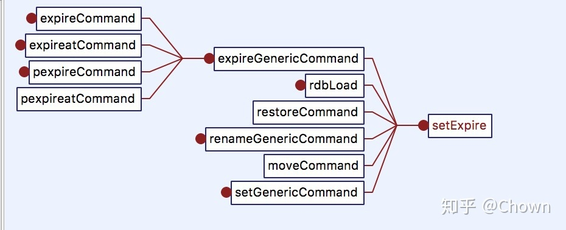
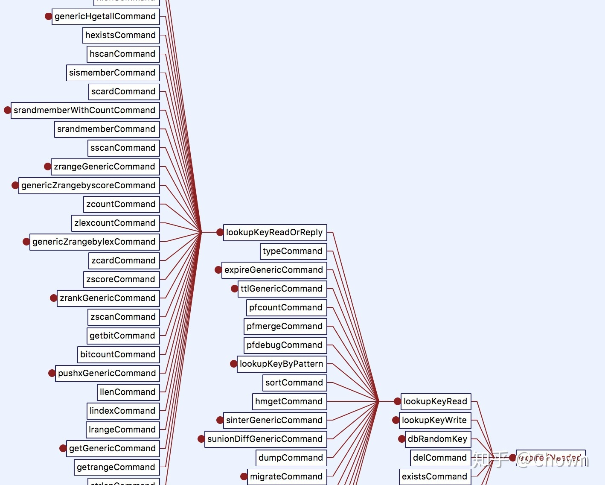
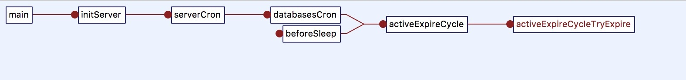

[主页](http://vonzhou.com)  | [读书](https://github.com/vonzhou/readings)  | [知乎](https://www.zhihu.com/people/vonzhou) | [GitHub](https://github.com/vonzhou)
---
# Redis中键的过期删除策略
---

Redis处理过期key的策略有定期删除和惰性删除。

使用Redis时我们可以使用`EXPIRE`或`EXPIREAT`命令给key设置过期删除时间，结构体`redisDb`中的`expires`字典保存了所有key的过期时间，这个字典（dict）的key是一个指针，指向redis中的某个key对象，过期字典的value是一个保存过期时间的整数。

```c
/* Redis database representation. There are multiple databases identified
 * by integers from 0 (the default database) up to the max configured
 * database. The database number is the 'id' field in the structure. */
typedef struct redisDb {
    dict *dict;                 /* The keyspace for this DB */
    dict *expires;              /* 过期字典*/
    dict *blocking_keys;        /* Keys with clients waiting for data (BLPOP) */
    dict *ready_keys;           /* Blocked keys that received a PUSH */
    dict *watched_keys;         /* WATCHED keys for MULTI/EXEC CAS */
    struct evictionPoolEntry *eviction_pool;    /* Eviction pool of keys */
    int id;                     /* Database ID */
    long long avg_ttl;          /* Average TTL, just for stats */
} redisDb;
```

## 设置过期时间

不论是`EXPIRE，EXPIREAT`，还是`PEXPIRE，PEXPIREAT`，底层的具体实现是一样的。在Redis的key空间中找到要设置过期时间的这个key，然后将这个entry（key的指针，过期时间）加入到过期字典中。

```c
void setExpire(redisDb *db, robj *key, long long when) {
    dictEntry *kde, *de;

    /* Reuse the sds from the main dict in the expire dict */
    kde = dictFind(db->dict,key->ptr);
    redisAssertWithInfo(NULL,key,kde != NULL);
    de = dictReplaceRaw(db->expires,dictGetKey(kde));
    dictSetSignedIntegerVal(de,when);
}
```



## 过期删除策略

如果一个key过期了，何时会被删除呢？在Redis中有两种过期删除策略：（1）惰性过期删除；（2）定期删除。接下来具体看看。

## 惰性过期删除

Redis在执行任何读写命令时都会先找到这个key，惰性删除就作为一个切入点放在查找key之前，如果key过期了就删除这个key。



```c
robj *lookupKeyRead(redisDb *db, robj *key) {
    robj *val;

    expireIfNeeded(db,key); // 切入点
    val = lookupKey(db,key);
    if (val == NULL)
        server.stat_keyspace_misses++;
    else
        server.stat_keyspace_hits++;
    return val;
}
```


## 定期删除

key的定期删除会在Redis的周期性执行任务（serverCron，默认每100ms执行一次）中进行，而且是发生Redis的master节点，因为slave节点会通过主节点的DEL命令同步过来达到删除key的目的。



依次遍历每个db（默认配置数是16），针对每个db，每次循环随机选择20个（ACTIVE_EXPIRE_CYCLE_LOOKUPS_PER_LOOP）key判断是否过期，如果一轮所选的key少于25%过期，则终止迭次，此外在迭代过程中如果超过了一定的时间限制则终止过期删除这一过程。


```c
for (j = 0; j < dbs_per_call; j++) {
    int expired;
    redisDb *db = server.db+(current_db % server.dbnum);

    /* Increment the DB now so we are sure if we run out of time
     * in the current DB we'll restart from the next. This allows to
     * distribute the time evenly across DBs. */
    current_db++;

    /* Continue to expire if at the end of the cycle more than 25%
     * of the keys were expired. */
    do {
        unsigned long num, slots;
        long long now, ttl_sum;
        int ttl_samples;

        /* 如果该db没有设置过期key，则继续看下个db*/
        if ((num = dictSize(db->expires)) == 0) {
            db->avg_ttl = 0;
            break;
        }
        slots = dictSlots(db->expires);
        now = mstime();

        /* When there are less than 1% filled slots getting random
         * keys is expensive, so stop here waiting for better times...
         * The dictionary will be resized asap. */
        if (num && slots > DICT_HT_INITIAL_SIZE &&
            (num*100/slots < 1)) break;

        /* The main collection cycle. Sample random keys among keys
         * with an expire set, checking for expired ones. */
        expired = 0;
        ttl_sum = 0;
        ttl_samples = 0;

        if (num > ACTIVE_EXPIRE_CYCLE_LOOKUPS_PER_LOOP)
            num = ACTIVE_EXPIRE_CYCLE_LOOKUPS_PER_LOOP;// 20

        while (num--) {
            dictEntry *de;
            long long ttl;

            if ((de = dictGetRandomKey(db->expires)) == NULL) break;
            ttl = dictGetSignedIntegerVal(de)-now;
            if (activeExpireCycleTryExpire(db,de,now)) expired++;
            if (ttl > 0) {
                /* We want the average TTL of keys yet not expired. */
                ttl_sum += ttl;
                ttl_samples++;
            }
        }

        /* Update the average TTL stats for this database. */
        if (ttl_samples) {
            long long avg_ttl = ttl_sum/ttl_samples;

            /* Do a simple running average with a few samples.
             * We just use the current estimate with a weight of 2%
             * and the previous estimate with a weight of 98%. */
            if (db->avg_ttl == 0) db->avg_ttl = avg_ttl;
            db->avg_ttl = (db->avg_ttl/50)*49 + (avg_ttl/50);
        }

        /* We can't block forever here even if there are many keys to
         * expire. So after a given amount of milliseconds return to the
         * caller waiting for the other active expire cycle. */
        iteration++;
        if ((iteration & 0xf) == 0) { /* 每迭代16次检查一次 */
            long long elapsed = ustime()-start;

            latencyAddSampleIfNeeded("expire-cycle",elapsed/1000);
            if (elapsed > timelimit) timelimit_exit = 1;
        }
		// 超过时间限制则退出
        if (timelimit_exit) return;
        /* 在当前db中，如果少于25%的key过期，则停止继续删除过期key */
    } while (expired > ACTIVE_EXPIRE_CYCLE_LOOKUPS_PER_LOOP/4);
}
```


## 总结

* 惰性删除：读写之前判断key是否过期
* 定期删除：定期抽样key，判断是否过期


