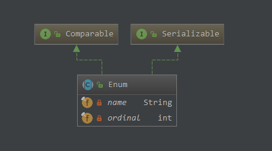

[主页](http://vonzhou.com)  | [读书](https://github.com/vonzhou/readings)  | [知乎](https://www.zhihu.com/people/vonzhou) | [GitHub](https://github.com/vonzhou)
---
# 为什么枚举是实现单例最好的方式？

提到单例模式（Singleton Pattern），都能说出一二，但是没那么简单。

## 实现单例的方式


### 法1：静态成员

不多说。

```java
public class Singleton1 {
    public static final Singleton1 INSTANCE = new Singleton1();

    private Singleton1() {
    }
}
```

### 法2：静态工厂

和法1一样，只不过通过工厂方法来返回实例，在API设计上更可取。

```java
public class Singleton2 {
    private static final Singleton2 INSTANCE = new Singleton2();

    private Singleton2() {
    }

    public static Singleton2 getInstance() {
        return INSTANCE;
    }
}
```

### 法3：lazy initialization 延迟初始化

前面法1，法2是饿汉式，lazy initialization 是懒汉式，需要的时候实例化，另外 double check。

```java
public class Singleton3 {
    private static Singleton3 INSTANCE = null;

    private Singleton3() {
    }

    public static Singleton3 getInstance() {
        if (INSTANCE == null) {
            synchronized (Singleton3.class) {
                if (INSTANCE == null) {
                    INSTANCE = new Singleton3();
                }
            }
        }
        return INSTANCE;
    }
}
```

这3种方法思路是一样的，都是把构造器搞成私有的，控制实例化的过程。但是 `private constructor` 是可以被绕过的：

* 序列化，反序列化
* 反射


### 序列化


Singleton1实例序列化，然后反序列化会得到一个不同的对象。

```java
public class Singleton1 implements Serializable {
    public static final Singleton1 INSTANCE = new Singleton1();

    private Singleton1() {
    }
}
```

```java
public class SingletonSerializationDemo {

    public static void main(String[] args) {
        // 对于Singleton2, 对于Singleton3 表现是一样的
        Singleton1 obj1 = Singleton1.INSTANCE;
        Singleton1 obj2 = Singleton1.INSTANCE;
        System.out.println(obj1 == obj2 ? "Two objects are same" : "Two objects are different");

        // 序列化 obj1
        try {
            ObjectOutputStream out = new ObjectOutputStream(new FileOutputStream("out.ser"));
            out.writeObject(obj1);
            out.close();
        } catch (IOException e) {
            e.printStackTrace();
        }


        Singleton1 obj3 = null;
        try {
            ObjectInputStream in = new ObjectInputStream(new FileInputStream("out.ser"));
            obj3 = (Singleton1) in.readObject();
            in.close();
        } catch (Exception i) {
            i.printStackTrace();
        }

        System.out.println(obj1 == obj3 ? "Two objects are same" : "Two objects are different");
    }
}
```

输出：

```
Two objects are same
Two objects are different
```

所以这样就违背了单例的初衷。为了使得反序列化后的对象是同一个，我们可以提供`readResolve`方法，会在反序列过程中被调用。

```java
public class Singleton1 implements Serializable {
    public static final Singleton1 INSTANCE = new Singleton1();

    private Singleton1() {
    }

    // 注释掉该方法， 进行对比
    protected Object readResolve() {
        return INSTANCE;
    }
}
```

输出：

```
Two objects are same
Two objects are same
```

### 反射

面对反射，private constructor也是无能为力。

```java
public class SingletonReflectionDemo {
    public static void main(String[] args) throws Exception {
        Singleton1 obj1 = Singleton1.INSTANCE;
        // 得到无参构造器
        Constructor constructor = obj1.getClass().getDeclaredConstructor(new Class[0]);
        // 这里使私有构造器可以访问
        constructor.setAccessible(true);
        Singleton1 obj2 = (Singleton1) constructor.newInstance();
        System.out.println(obj1 == obj2 ? "Two objects are same" : "Two objects are different");
    }
}
```

输出：

```
Two objects are different
```

那么面对序列化，反射，有没有更好实现Singleton的方式？enum.....

## enum是实现单例最好的方式（法4）

```java
public enum SingletonUsingEnum {
    INSTANCE
}
```

**反序列化得到的也是同一个实例。**

```java
public class SingletonUsingEnumSerializationDemo {
    public static void main(String[] args) {
        SingletonUsingEnum obj1 = SingletonUsingEnum.INSTANCE;

        // 序列化 obj1
        try {
            ObjectOutputStream out = new ObjectOutputStream(new FileOutputStream("out.ser"));
            out.writeObject(obj1);
            out.close();
        } catch (IOException e) {
            e.printStackTrace();
        }


        SingletonUsingEnum obj3 = null;
        try {
            ObjectInputStream in = new ObjectInputStream(new FileInputStream("out.ser"));
            obj3 = (SingletonUsingEnum) in.readObject();
            in.close();
        } catch (Exception i) {
            i.printStackTrace();
        }
        System.out.println(obj1 == obj3 ? "Two objects are same" : "Two objects are different");
    }
}
```

输出：

```
Two objects are same
```


**使用反射创建Enum实例的时候，会抛出异常。**

```java
public class SingletonUsingEnumReflectionDemo {
    public static void main(String[] args) throws Exception {
        SingletonUsingEnum obj1 = SingletonUsingEnum.INSTANCE;
        Constructor constructor = obj1.getClass().getDeclaredConstructors()[0];
        constructor.setAccessible(true);
        SingletonUsingEnum obj2 = (SingletonUsingEnum) constructor.newInstance();
        System.out.println(obj1 == obj2 ? "Two objects are same" : "Two objects are different");
    }
}
```

输出：

```java
Exception in thread "main" java.lang.IllegalArgumentException: Cannot reflectively create enum objects
	at java.lang.reflect.Constructor.newInstance(Constructor.java:417)
	at lang.enumsingleton.SingletonUsingEnumReflectionDemo.main(SingletonUsingEnumReflectionDemo.java:16)
```


## 枚举是一个语法糖

一个例子开始。

```java
public enum ColorEnum {
    RED,
    BLUE
}
```

对class文件进行反编译， `javap -v ColorEnum.class` 输出：

```java
Classfile /D:/GitHub/learning-java/target/classes/lang/ColorEnum.class
  Last modified 2019-2-14; size 898 bytes
  MD5 checksum 79dff593c44747f1648cd48465351caf
  Compiled from "ColorEnum.java"
public final class lang.ColorEnum extends java.lang.Enum<lang.ColorEnum>
  minor version: 0
  major version: 52
  flags: ACC_PUBLIC, ACC_FINAL, ACC_SUPER, ACC_ENUM
Constant pool:
   #1 = Fieldref           #4.#36         // lang/ColorEnum.$VALUES:[Llang/ColorEnum;
   #2 = Methodref          #37.#38        // "[Llang/ColorEnum;".clone:()Ljava/lang/Object;
   #3 = Class              #17            // "[Llang/ColorEnum;"
   #4 = Class              #39            // lang/ColorEnum
   #5 = Methodref          #12.#40        // java/lang/Enum.valueOf:(Ljava/lang/Class;Ljava/lang/String;)Ljava/lang/Enum;
   #6 = Methodref          #12.#41        // java/lang/Enum."<init>":(Ljava/lang/String;I)V
   #7 = String             #13            // RED
   #8 = Methodref          #4.#41         // lang/ColorEnum."<init>":(Ljava/lang/String;I)V
   #9 = Fieldref           #4.#42         // lang/ColorEnum.RED:Llang/ColorEnum;
  #10 = String             #15            // BLUE
  #11 = Fieldref           #4.#43         // lang/ColorEnum.BLUE:Llang/ColorEnum;
  #12 = Class              #44            // java/lang/Enum
  #13 = Utf8               RED
  #14 = Utf8               Llang/ColorEnum;
  #15 = Utf8               BLUE
  #16 = Utf8               $VALUES
  #17 = Utf8               [Llang/ColorEnum;
  #18 = Utf8               values
  #19 = Utf8               ()[Llang/ColorEnum;
  #20 = Utf8               Code
  #21 = Utf8               LineNumberTable
  #22 = Utf8               valueOf
  #23 = Utf8               (Ljava/lang/String;)Llang/ColorEnum;
  #24 = Utf8               LocalVariableTable
  #25 = Utf8               name
  #26 = Utf8               Ljava/lang/String;
  #27 = Utf8               <init>
  #28 = Utf8               (Ljava/lang/String;I)V
  #29 = Utf8               this
  #30 = Utf8               Signature
  #31 = Utf8               ()V
  #32 = Utf8               <clinit>
  #33 = Utf8               Ljava/lang/Enum<Llang/ColorEnum;>;
  #34 = Utf8               SourceFile
  #35 = Utf8               ColorEnum.java
  #36 = NameAndType        #16:#17        // $VALUES:[Llang/ColorEnum;
  #37 = Class              #17            // "[Llang/ColorEnum;"
  #38 = NameAndType        #45:#46        // clone:()Ljava/lang/Object;
  #39 = Utf8               lang/ColorEnum
  #40 = NameAndType        #22:#47        // valueOf:(Ljava/lang/Class;Ljava/lang/String;)Ljava/lang/Enum;
  #41 = NameAndType        #27:#28        // "<init>":(Ljava/lang/String;I)V
  #42 = NameAndType        #13:#14        // RED:Llang/ColorEnum;
  #43 = NameAndType        #15:#14        // BLUE:Llang/ColorEnum;
  #44 = Utf8               java/lang/Enum
  #45 = Utf8               clone
  #46 = Utf8               ()Ljava/lang/Object;
  #47 = Utf8               (Ljava/lang/Class;Ljava/lang/String;)Ljava/lang/Enum;
{
  public static final lang.ColorEnum RED;
    descriptor: Llang/ColorEnum;
    flags: ACC_PUBLIC, ACC_STATIC, ACC_FINAL, ACC_ENUM

  public static final lang.ColorEnum BLUE;
    descriptor: Llang/ColorEnum;
    flags: ACC_PUBLIC, ACC_STATIC, ACC_FINAL, ACC_ENUM

  public static lang.ColorEnum[] values();
    descriptor: ()[Llang/ColorEnum;
    flags: ACC_PUBLIC, ACC_STATIC
    Code:
      stack=1, locals=0, args_size=0
         0: getstatic     #1                  // Field $VALUES:[Llang/ColorEnum;
         3: invokevirtual #2                  // Method "[Llang/ColorEnum;".clone:()Ljava/lang/Object;
         6: checkcast     #3                  // class "[Llang/ColorEnum;"
         9: areturn
      LineNumberTable:
        line 7: 0

  public static lang.ColorEnum valueOf(java.lang.String);
    descriptor: (Ljava/lang/String;)Llang/ColorEnum;
    flags: ACC_PUBLIC, ACC_STATIC
    Code:
      stack=2, locals=1, args_size=1
         0: ldc           #4                  // class lang/ColorEnum
         2: aload_0
         3: invokestatic  #5                  // Method java/lang/Enum.valueOf:(Ljava/lang/Class;Ljava/lang/String;)Ljava/lang/Enum;
         6: checkcast     #4                  // class lang/ColorEnum
         9: areturn
      LineNumberTable:
        line 7: 0
      LocalVariableTable:
        Start  Length  Slot  Name   Signature
            0      10     0  name   Ljava/lang/String;

  static {};
    descriptor: ()V
    flags: ACC_STATIC
    Code:
      stack=4, locals=0, args_size=0
         0: new           #4                  // class lang/ColorEnum
         3: dup
         4: ldc           #7                  // String RED
         6: iconst_0
         7: invokespecial #8                  // Method "<init>":(Ljava/lang/String;I)V
        10: putstatic     #9                  // Field RED:Llang/ColorEnum;
        13: new           #4                  // class lang/ColorEnum
        16: dup
        17: ldc           #10                 // String BLUE
        19: iconst_1
        20: invokespecial #8                  // Method "<init>":(Ljava/lang/String;I)V
        23: putstatic     #11                 // Field BLUE:Llang/ColorEnum;
        26: iconst_2
        27: anewarray     #4                  // class lang/ColorEnum
        30: dup
        31: iconst_0
        32: getstatic     #9                  // Field RED:Llang/ColorEnum;
        35: aastore
        36: dup
        37: iconst_1
        38: getstatic     #11                 // Field BLUE:Llang/ColorEnum;
        41: aastore
        42: putstatic     #1                  // Field $VALUES:[Llang/ColorEnum;
        45: return
      LineNumberTable:
        line 8: 0
        line 9: 13
        line 7: 26
}
Signature: #33                          // Ljava/lang/Enum<Llang/ColorEnum;>;
SourceFile: "ColorEnum.java"
```

可以看到：

* 定义的枚举最终就是一个继承了`java.lang.Enum`的类
* 生成了2个静态方法`valueOf()`, `values()`
* 定义了2个`static final`变量 `RED`, `BLUE`，并且在静态块中进行了实例化


## Enum 分析




```java
public abstract class Enum<E extends Enum<E>> implements Comparable<E>, Serializable {
    private final String name;
    private final int ordinal;

    public final String name() {
        return this.name;
    }

    public final int ordinal() {
        return this.ordinal;
    }

    protected Enum(String var1, int var2) {
        this.name = var1;
        this.ordinal = var2;
    }

    public String toString() {
        return this.name;
    }

    public final boolean equals(Object var1) {
        return this == var1;
    }

    public final int hashCode() {
        return super.hashCode();
    }

    protected final Object clone() throws CloneNotSupportedException {
        throw new CloneNotSupportedException();
    }

    public final int compareTo(E var1) {
        if (this.getClass() != var1.getClass() && this.getDeclaringClass() != var1.getDeclaringClass()) {
            throw new ClassCastException();
        } else {
            return this.ordinal - var1.ordinal;
        }
    }

    public final Class<E> getDeclaringClass() {
        Class var1 = this.getClass();
        Class var2 = var1.getSuperclass();
        return var2 == Enum.class ? var1 : var2;
    }

    public static <T extends Enum<T>> T valueOf(Class<T> var0, String var1) {
        Enum var2 = (Enum)var0.enumConstantDirectory().get(var1);
        if (var2 != null) {
            return var2;
        } else if (var1 == null) {
            throw new NullPointerException("Name is null");
        } else {
            throw new IllegalArgumentException("No enum constant " + var0.getCanonicalName() + "." + var1);
        }
    }

    // enum class 不能实现 finalize 方法，为什么？？
    protected final void finalize() {
    }

    private void readObject(ObjectInputStream var1) throws IOException, ClassNotFoundException {
        throw new InvalidObjectException("can't deserialize enum");
    }

    private void readObjectNoData() throws ObjectStreamException {
        throw new InvalidObjectException("can't deserialize enum");
    }
}
```

接下来看看Enum的序列化，反序列化过程。

Enum序列化的实现在`java.io.ObjectOutputStream.writeEnum`中，可以看到**只对枚举的名称进行了序列化**。

```java
private void writeEnum(Enum<?> en,
                           ObjectStreamClass desc,
                           boolean unshared)
        throws IOException
    {
        bout.writeByte(TC_ENUM); // 特殊标记
        ObjectStreamClass sdesc = desc.getSuperDesc();
        writeClassDesc((sdesc.forClass() == Enum.class) ? desc : sdesc, false);
        handles.assign(unshared ? null : en);
        // 这里
        writeString(en.name(), false);
    }
```

反序列化的实现在`java.io.ObjectInputStream.readEnum`，读出Enum的name之后，从常量字典中查找出对应的枚举常量，保证了唯一性。

```java
private Enum<?> readEnum(boolean unshared) throws IOException {
        if (bin.readByte() != TC_ENUM) {
            throw new InternalError();
        }

        ObjectStreamClass desc = readClassDesc(false);
        if (!desc.isEnum()) {
            throw new InvalidClassException("non-enum class: " + desc);
        }

        int enumHandle = handles.assign(unshared ? unsharedMarker : null);
        ClassNotFoundException resolveEx = desc.getResolveException();
        if (resolveEx != null) {
            handles.markException(enumHandle, resolveEx);
        }

        String name = readString(false);
        Enum<?> result = null;
        Class<?> cl = desc.forClass();
        if (cl != null) {
            try {
                // 关键代码
                @SuppressWarnings("unchecked")
                Enum<?> en = Enum.valueOf((Class)cl, name);
                result = en;
            } catch (IllegalArgumentException ex) {
                throw (IOException) new InvalidObjectException(
                    "enum constant " + name + " does not exist in " +
                    cl).initCause(ex);
            }
            if (!unshared) {
                handles.setObject(enumHandle, result);
            }
        }

        handles.finish(enumHandle);
        passHandle = enumHandle;
        return result;
    }
```

所以，enum是实现单例最好的方式。