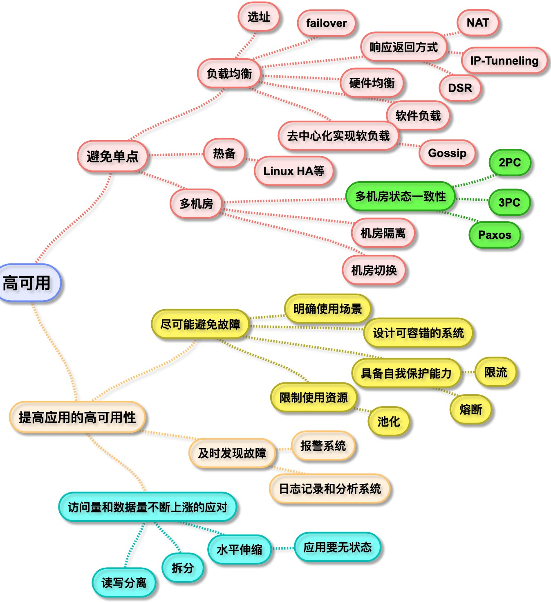

# 分布式Java应用 基础与实践

## 1.分布式Java应用

BIO,NIO,AIO

RPC

性能角度:反射,序列化反序列化

## 3. 深入理解JVM

javac生成Class文件的过程

ClassLoader

JMM 内存模型

同步机制

## 4. JDK类库

集合包

并发包

## 5. 性能调优

## 6. 构建高可用系统

## 7. 构建可伸缩系统

